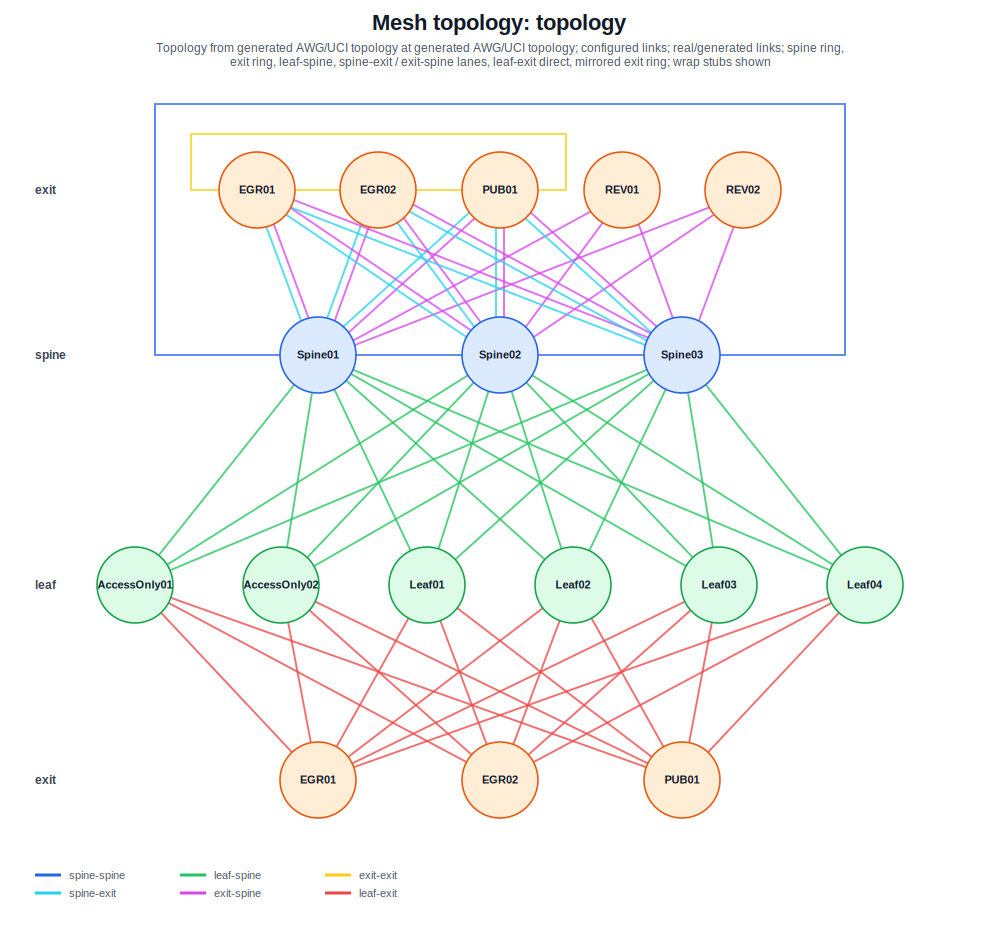

# OpenWrt Spine-Leaf Mesh Builder



OpenWrt Spine-Leaf Mesh Builder собирает из обычных OpenWrt-роутеров и Linux-серверов маленький routed fabric. Spine здесь - роутеры с белым IP, leaf - роутеры за NAT или с серым IP, а exit - управляемые точки выхода в интернет. В результате получается не один VPN-туннель до одного сервера, а живая сеть: роутеры видят друг друга через overlay, leaf без белого IP становится достижимым из других LAN и access-сетей, reverse exit без белого IP участвует в egress, а пользовательский трафик получает несколько отказоустойчивых путей к интернету.

Топология описывается в `config.json`. Из неё генерируются OpenWrt overlay files, server configs, access-клиенты, SSH aliases, firewall rules, Babel routing и IPIP exit data-plane. OpenWrt firmware-образы собираются отдельной командой `./build_router_images.py`.

Проект рассчитан на OpenWrt 25.12+ и AWG2/apk-only builds.

## Что это даёт

Главная идея - превратить набор роутеров, VPS и домашних сетей в управляемую routed mesh-сеть.

- Multi-exit egress: у роутера может быть несколько exit-серверов с приоритетом; активный выход выбирается по Babel-достижимости.
- Связность между роутерами: это не только путь до exit, но и путь до LAN другого роутера, даже если тот за NAT.
- Reverse узлы: leaf-router или exit без белого IP сам подключается к spine и становится частью overlay после bootstrap.
- Dynamic routing: Babel сам перестраивает overlay path при падении линка, spine или exit-достижимости.
- Детерминированная адресация: p2p `/31`, node IP, announce prefixes и порты генерируются стабильно из имён и link keys.
- Безопасность не превращается в flat network: firewall zones, `allow_to_router`, `allow_to_lan`, access policies, direct lists и server guard ограничивают, кто куда может ходить.

Итоговый пользовательский эффект простой: если один путь сломался, сеть часто может найти другой. Если перестроился только внутренний путь до того же exit, внешний сайт продолжает видеть тот же egress/NAT IP, поэтому для пользователя это чаще выглядит как короткая потеря пакетов, а не как полная смена сети. Если меняется сам selected exit и внешний NAT IP, старые TCP-сессии могут оборваться, но новые соединения уйдут через доступный выход.

## Идея сети

Это не набор VPN-пиров `каждый с каждым`, а routed fabric с разделением control-plane и data-plane.

Внизу находится обычный WAN/Internet underlay: провайдерские сети, публичные IP, серые IP, NAT, VPS и домашние роутеры. Поверх него строится encrypted infra overlay из p2p AWG/WG-линков. На этих линках работает Babel, поэтому маршруты внутри сети не прописываются руками для каждой пары узлов, а появляются и исчезают динамически.

Поверх этого есть отдельный exit data-plane. Пользовательский трафик, который должен выйти через exit, не просто отправляется в один VPN-интерфейс. Роутер инкапсулирует его в IPIP до active exit, а маршрут до IPIP endpoint выбирается overlay routing-ом. Поэтому реальный путь пакета может быть достаточно хитрым: через spine, через другой router, а иногда даже через другой exit как transit overlay-hop, если так сошлась маршрутизация.

Благодаря этому multi-exit схема удобнее обычного `один роутер -> один VPN-сервер`. Fabric даёт не только egress в интернет, но и связность между площадками: можно разрешить LAN одного роутера ходить к LAN другого, подключить access-клиента к одному публичному endpoint и всё равно попасть в нужный remote segment, или держать exit-сервер без входящего public endpoint.

При этом связность не означает открытый общий broadcast-domain. Проект генерирует routed overlay, а не L2-мост. Firewall model остаётся явной: LAN, Mesh, Exit, ExitIPIP, TrustedAccess и TransitAccess разделены зонами; доступ к роутерам и LAN задаётся через `allow_to_router` и `allow_to_lan`; direct destinations не отправляются через exit; server guard на exit-ах дополнительно дропает нежелательный direct выход, если такой пакет всё же дошёл до сервера.

## Отказоустойчивость

За счёт Babel сеть получает практическую отказоустойчивость на уровне маршрутизации. Если leaf-роутер теряет один spine, но видит другой, Babel перестраивает маршрут. Если public exit недоступен напрямую, путь до его overlay endpoint может пройти через другой живой узел. Если reverse exit не имеет белого IP, он всё равно может подключиться наружу к spine и стать доступным внутри overlay после bootstrap.

За выбор активного egress отвечает `exit-route.sh`. Он раз в 5 секунд проверяет, какой exit marker-prefix виден через Babel, выбирает первый reachable exit из `exit_order` и синхронизирует с ним default route в table `200`.

Если ни один exit не анонсируется через Babel, скрипт оставляет UCI-секцию `network.exit200`, но ставит `disabled=1`. В этом состоянии policy route не применяется, и трафик возвращается на обычный main default path.

Это не заменяет физическую отказоустойчивость провайдера или питания. Если у узла не осталось ни одного живого пути в fabric, маршрутизировать его уже некуда. Но пока есть альтернативный tunnel path, сеть может переживать падение отдельных линков, spine-узлов и exit-ов.

## Spine-leaf на домашних и edge-роутерах

В ЦОДовой spine-leaf схеме leaf подключает клиентов и серверы, а spine даёт связность между leaf-ами. Здесь та же идея удачно ложится на роутеры с белым и серым IP.

Роутеры с белым IP становятся spine/hub-узлами. Они принимают входящие tunnel-связи от leaf-роутеров, других spine и exit-серверов.

Роутеры с серым IP или за NAT становятся leaf-узлами. Им не нужен входящий доступ из интернета: они сами поднимают outbound-туннели ко всем публичным spine.

`access_only` узел похож на edge endpoint: он имеет публичный `listen_ip` и принимает пользовательские access-группы, но не становится transit spine для infra mesh.

Exit-серверы подключаются к fabric и дают управляемый egress в интернет. Public exit принимает туннели напрямую, reverse/internal exit сам подключается к spine и работает через overlay.

Так получается почти ЦОДовая модель, но адаптированная под реальность домашних роутеров, VPS и NAT: белые адреса становятся точками агрегации, серые адреса остаются leaf, а маршрутизация между ними остаётся динамической.

## Сетевые слои

Проект разделяет несколько слоёв.

```text
WAN underlay        реальная сеть провайдера, NAT, public IP, VPS
encrypted overlay   p2p AWG/WG-линки между router, spine и exit
routing plane       Babel поверх tunnel-интерфейсов
exit data-plane     IPIP от роутеров до выбранного exit
policy plane        fwmark, uid rule и routing table 200
```

AWG/WG-линки дают защищённую связность и транспорт для Babel. Babel отвечает за достижимость overlay-узлов и service prefixes. IPIP используется отдельно как data-plane до exit-сервера: пользовательский трафик, который должен выйти через exit, направляется в table `200` и уходит через активный IPIP-интерфейс.

## Адресация без ручного IPAM

Служебная адресация генерируется детерминированно из имён узлов и link keys. Не нужно вручную вести таблицу p2p-адресов и портов.

Основные идеи:

- infra p2p-линки получают `/31` из `INFRA_LINK_POOL`;
- exit announce prefixes получают `/31` из `EXIT_ANNOUNCE_SUPERNET4`;
- exit node prefixes получают `/31` из `EXIT_NODE_SUPERNET4`;
- IPv6 link-local адреса для infra-линков строятся из IPv4-адресов;
- AWG ports и часть служебных имён также выбираются стабильно;
- генератор и `tools/validate.py` проверяют пересечения и ошибки.

То есть `config.json` описывает намерение: какие есть узлы, кто является spine, какие есть exit и access-входы. Низкоуровневые адреса, p2p-сети, интерфейсы, firewall zones, Babel config и SSH aliases выводятся из этой модели автоматически.

## Что проект делает

После `./generate_configs.py` появляются:

- конфиги для OpenWrt-роутеров;
- конфиги для exit-серверов;
- AmneziaWG, WireGuard и OpenVPN access-группы;
- Babel routing поверх tunnel-линков;
- IPIP data-plane до exit-серверов;
- firewall-зоны, allow rules, fwmark и policy routing;
- direct ipsets для трафика, который не надо отправлять через exit;
- server guard rules против нежелательного direct выхода;
- per-router и per-server SSH keys и SSH config.

OpenWrt firmware-образы появляются отдельно после `./build_router_images.py` и складываются в `images/`.

Сами шаблоны лежат в `routers/example` и `servers/example`. Конкретные узлы создаются рядом с ними после запуска `./generate_configs.py`.

## Модель сети

Основные сущности в `config.json`:

```text
openwrt_version  версия OpenWrt, минимум 25.12
device_profiles  соответствие профиля OpenWrt target/subtarget и apk arch
packages         дополнительные глобальные пакеты для всех роутеров
routers          все OpenWrt-роутеры проекта
mesh_hubs        публичные router-узлы со spine-ролью или access endpoint
exit_hubs        Linux-серверы выхода в интернет
exit_order       глобальный приоритет exit-серверов
access           пользовательские WG/AWG/OpenVPN-входы на router-узлах
```

### Router

`routers` описывает все OpenWrt-устройства.

У router задаются:

- `name` - имя узла;
- `device_profile` - обязательная ссылка на профиль из `device_profiles`;
- `subnet` - LAN-сеть роутера, обычно canonical `/24`;
- `packages` - per-router добавление или удаление дополнительных пакетов;
- `wifi_2g`, `wifi_5g` - Wi-Fi параметры;
- `allow_to_router` - к каким target-роутерам разрешён INPUT на сам роутер;
- `allow_to_lan` - к каким target-роутерам разрешён FORWARD в их LAN;
- `exit_order` - индивидуальный порядок выбора exit-серверов.

`allow_to_router` и `allow_to_lan` описывают исходящее разрешение от source-сети текущего роутера или access-группы к target-роутерам. Это не входящая ACL на source. Генератор добавляет firewall rules на target-роутере.

Пример из текущего `config.json`:

```json
{
  "name": "Leaf01",
  "device_profile": "asus_rt-ax53u",
  "subnet": "10.101.11.0/24",
  "allow_to_router": ["Spine01"]
}
```

В этом фрагменте LAN `Leaf01` может обращаться к самому роутеру `Spine01`.
Пример доступа в LAN других роутеров есть у `Leaf04`:

```json
{
  "name": "Leaf04",
  "device_profile": "asus_rt-ax53u",
  "subnet": "10.101.21.0/24",
  "allow_to_lan": ["Spine01", "Leaf01"]
}
```

В этом фрагменте LAN `Leaf04` может форвардиться в LAN `Spine01` и `Leaf01`.

Директория роутера создаётся как lowercase slug:

```text
Spine01  -> routers/spine01/
Leaf03   -> routers/leaf03/
```

### Mesh hub / spine

`mesh_hubs` добавляет публичную endpoint-роль поверх уже описанного router-узла.

```json
{
  "name": "Spine01",
  "listen_ip": "203.0.113.11"
}
```

Обычный `mesh_hub` становится spine-узлом: на нём слушаются infra AmneziaWG-линки от leaf-роутеров, других spine и exit-серверов. Babel использует эти линки как routed overlay.

Если указать `access_only: true`, узел получает публичный endpoint только для пользовательских access-групп, но не становится spine:

```json
{
  "name": "AccessOnly01",
  "listen_ip": "203.0.113.31",
  "access_only": true
}
```

`mesh_hubs[].name` всегда ссылается на существующий router. `listen_ip` задаётся canonical IPv4-адресом без порта и hostname. Один и тот же `listen_ip` нельзя использовать в нескольких `mesh_hubs`, включая `access_only` hubs.

### Exit hub

`exit_hubs` описывает Linux-серверы, через которые пользовательский трафик выходит в интернет.

```json
{
  "name": "EGR01",
  "listen_ip": "198.51.100.21",
  "exit_ip": "198.51.100.121"
}
```

Поддерживаются варианты:

| Config | Смысл |
|---|---|
| `name` | reverse/internal exit без публичного endpoint |
| `name + listen_ip` | public exit, принимающий AWG-связи |
| `name + listen_ip + exit_ip` | public exit с отдельным SNAT-адресом |

`listen_ip` - адрес, куда подключаются tunnel peers.

`exit_ip` - публичный egress-адрес для SNAT. Если `exit_ip` не задан, сервер использует MASQUERADE через default interface.

`listen_ip` и `exit_ip` задаются только как canonical usable unicast IPv4-адреса. Hostname и `ip:port` не используются в config-модели.

Имя exit-сервера ограничено сильнее обычных имён: `A-Z`, `0-9`, `_`, первая буква `A-Z`, максимум 8 ASCII-байт. Это нужно, чтобы generated Linux IPIP device вида `ipip-ip<EXIT>` помещался в лимит 15 видимых байт.

Директория сервера создаётся как lowercase slug:

```text
EGR01 -> servers/egr01/
REV01 -> servers/rev01/
```

Reverse-only exit без `listen_ip` первично деплоится руками. После bootstrap он получает generated node IP из `EXIT_NODE_SUPERNET4`, и дальнейший SSH/deploy может идти через `server_<exit-slug>_node`.

### Access

`access` задаёт пользовательские входы в overlay.

Поддерживаемые протоколы:

- `wireguard`;
- `amneziawg`;
- `openvpn`.

Пример:

```json
"access": {
  "Spine01": [
    {
      "name": "AdminWG",
      "protocol": "wireguard",
      "policy": "trusted",
      "port": 45110,
      "subnet": "10.201.1.0/24",
      "allow_to_router": ["all"],
      "allow_to_lan": ["all"],
      "users": ["AdminLaptop", "AdminPhone"]
    }
  ]
}
```

Access-группа должна висеть на router-узле с публичным endpoint: обычном `mesh_hub` или `access_only` hub.

Политики:

| Policy | Firewall zone | Поведение |
|---|---|---|
| `trusted` | `TrustedAccess` | Доступ к самому access-роутеру, LAN, Mesh, Exit и WAN |
| `transit` | `TransitAccess` | Нет доступа к самому роутеру и LAN; разрешён DNS и транзит в Mesh/Exit/WAN |

`allow_to_router` и `allow_to_lan` у access-группы работают так же, как у router. Source-сетью будет subnet access-группы, а target-роутеры берутся из соответствующего списка.

Access `port` не должен попадать в `INFRA_AWG_PORT_RANGE`, потому что этот диапазон принадлежит generated infra/exit tunnel ports.

## Быстрый старт

```bash
# 1. Описать сеть
vim config.json

# 2. Сгенерировать конфиги, ключи и проверки
# OWMB master-key files создаются автоматически по secrets_key_path/materials_key_path.
./generate_configs.py

# 3. Задеплоить exit-серверы
./deploy_servers.py

# 4. Собрать OpenWrt firmware-образы
./build_router_images.py

# 5. Обновить роутеры образами текущего git commit из images/
./upgrade_routers.py
```

Для локального просмотра структуры, без загрузки AWG-пакетов и без синхронизации `packages/`, можно запускать так:

```bash
./generate_configs.py --skip-awg-download --skip-package-sync
```

Такой режим удобен, если AWG `.apk` и per-router package repos уже не нужны для текущей проверки. Hooks при этом всё равно запускаются, поэтому `tools/generate.py` всё ещё может требовать `wg` и `openssl`, если нужно создать недостающие WireGuard/OpenVPN secrets. Для просмотра только синхронизированной template-структуры без generator hooks добавляй `--skip-hooks`. Dynamic direct-list sources из `tools/default.py` должны быть доступны, если они включены.

## Как строятся линки

Infra-связи строятся поверх AmneziaWG.

```text
spine-spine       ring между публичными spine
leaf -> spine     каждый leaf подключается ко всем spine
router -> exit    каждый router подключается ко всем public exit
exit -> spine     каждый exit подключается к публичным spine
exit-exit         ring между public exit-серверами
```

Reverse exit без `listen_ip` не принимает входящие tunnel-связи от роутеров. Он сам поднимает outbound-туннели к публичным spine и становится доступен внутри overlay после bootstrap.

На infra-линках не включается обычный default route. Они используются как транспорт для Babel и служебной маршрутизации.

## Служебная адресация

Основные пулы задаются в `tools/default.py`.

```python
INFRA_LINK_POOL          = "10.255.0.0/16"
EXIT_ANNOUNCE_SUPERNET4 = "10.254.0.0/24"
EXIT_NODE_SUPERNET4     = "10.254.1.0/24"
```

### Infra p2p links

Для AWG p2p-линков генератор детерминированно выделяет `/31` из `INFRA_LINK_POOL`.

```text
link key -> stable hash -> /31 из 10.255.0.0/16
```

Для каждого IPv4-адреса дополнительно строится IPv6 link-local вида:

```text
10.255.x.y -> fe80::10:255:x:y/64
```

### Exit announce prefix

Каждый exit получает служебный `/31` из `EXIT_ANNOUNCE_SUPERNET4`.

Этот prefix не является публичным `exit_ip`. Он нужен роутерам как marker достижимости exit-а. Если Babel видит marker-prefix, `exit-route.sh` считает соответствующий exit usable для IPIP data-plane.

### Exit node prefix

Каждый exit получает node/control prefix из `EXIT_NODE_SUPERNET4`.

Он нужен для:

- SSH к exit-серверу после bootstrap;
- healthcheck;
- inventory;
- доступа к reverse exit без белого IP;
- доступа к public exit, если SSH по public IP закрыт.

Node-IP выбирается стабильно по имени exit-а, а не по позиции в `exit_order`.

## Выбор exit-а и IPIP data-plane

Пользовательский трафик до exit идёт через IPIP.

На OpenWrt-роутерах генерируются IPIP-интерфейсы до exit-серверов. Их порядок определяется так:

1. `routers.<name>.exit_order`, если задан;
1. глобальный `exit_order` из `config.json`.

`exit_order` влияет на приоритет выбора выхода, но не меняет сгенерированные announce/node prefixes. Глобальный `exit_order` должен содержать все exit-серверы. Per-router `exit_order` может содержать только часть exit-ов; в этом случае роутер выбирает только из этого списка и не дополняет его глобальным порядком.

На роутере `exit-route.sh` периодически проверяет достижимость exit marker-prefix через Babel и переключает активный выход. Traffic steering делается через policy routing:

```text
fwmark 0x25 -> table 200
uid 4453    -> table 200
```

Через table `200` идут помеченный пользовательский трафик и DoH bootstrap-трафик пользователя `https-dns-proxy`.

Если ни один exit не достижим через Babel, `exit-route.sh` оставляет UCI-секцию `network.exit200`, но ставит `disabled=1`. После этого помеченный трафик возвращается на обычный main default path.

## Direct lists и server guard

Проект различает трафик, который должен идти напрямую, и трафик, который должен идти через exit.

Direct-листы собираются из нескольких источников.

Статическая часть генерируется в `/etc/ipsets/direct-static.txt`. В неё попадают:

- локальные/private/special-use IPv4-сети из `LOCAL_DIRECT_IPSETS`;
- публичные `listen_ip` и `exit_ip` из `config.json`;
- дополнительные CIDR-prefixes из `EXIT_DIRECT_STATIC_IPSETS`.

Динамическая часть задаётся странами и ASN. На роутерах и exit-серверах эти настройки лежат в runtime env как:

```sh
DIRECT_COUNTRIES='ru cn by'
DIRECT_ASNS='32590'
```

`update-ipsets.sh` читает `/etc/ipsets/direct-static.txt`, добавляет country/ASN lists, атомарно обновляет `/etc/ipsets/direct.txt` и перезагружает firewall только если итоговый список изменился. Трафик к direct destination не получает mark `0x25`, поэтому не уходит через exit table.

На exit-серверах direct-листы используются как обратная защита. Нужные для guard-настроек переменные лежат в `/etc/awg-server.env`; отдельный `/etc/router-autoinstall.env` на серверах не создаётся. Нормальный direct-трафик должен отсечься ещё на роутере и не прийти на exit. Но если он всё-таки пришёл через managed exit subnet, `exit-direct-guard.service` держит FORWARD guard rule и дропает такой выход в WAN.

Иными словами:

```text
router direct rule  -> не отправлять direct destination на exit
server guard rule   -> если direct destination всё-таки пришёл на exit, drop
```

`exit-direct-guard.timer` обновляет guard ежедневно, а `awg-server-network.service` ставит guard из уже существующего списка при network-up.

## Firewall model на OpenWrt

Генератор создаёт managed zones:

- `Mesh` - infra overlay между роутерами;
- `Exit` - AWG/WG-линки к exit-серверам;
- `ExitIPIP` - IPIP data-plane до exit;
- `TrustedAccess` - пользовательские trusted входы;
- `TransitAccess` - пользовательские transit входы.

Общая идея:

- LAN может идти в Mesh, Exit, ExitIPIP;
- TrustedAccess может идти в LAN, Mesh, Exit и WAN;
- TransitAccess не получает input к самому роутеру, но может транзитить;
- точечный доступ к самим роутерам задаётся через `allow_to_router`;
- direct destinations исключаются из exit-marking через ipset;
- точечный доступ к LAN других роутеров задаётся через `allow_to_lan`;
- IPIP destination clear mark rule снимает mark при уходе в `ExitIPIP`.

Файл `routers/example/files/etc/config/firewall_part` состоит из generated managed-части и общей tail-части после marker-а:

```text
# Unique part up to this line
```

## Что генерируется

### Для роутеров

После `./generate_configs.py` для каждого router создаётся дерево managed/template-файлов:

```text
routers/<router-slug>/
  files/etc/config/network_part
  files/etc/config/firewall_part
  files/etc/config/babeld
  files/etc/dropbear/authorized_keys
  files/etc/router-autoinstall.env
  files/etc/ipsets/direct-static.txt
  files/etc/ipsets/direct.txt
  files/etc/scripts/*.sh
  files/etc/init.d/*
  files/etc/crontabs/root
  packages/*.apk
```

Access-specific файлы появляются только на роутерах с соответствующими access-группами:

```text
files/etc/config/openvpn                         # только при OpenVPN access
files/etc/openvpn/<AccessName>/server.ovpn       # только при OpenVPN access
files/etc/openvpn/<AccessName>/clients/*.ovpn    # только при OpenVPN access
files/etc/wireguard/<AccessName>/clients/*.conf  # при WireGuard или AmneziaWG access
```

`routers/example` остаётся шаблоном. Конкретные роутеры создаются рядом с ним в lowercase-директориях.

### Для exit-серверов

Для каждого exit создаётся:

```text
servers/<exit-slug>/
  etc/awg-server.env
  etc/amnezia/amneziawg/*.conf
  etc/babel<exit-slug>.conf
  etc/ipsets/direct-static.txt
  etc/ipsets/direct.txt
  etc/systemd/system/*.service
  etc/systemd/system/*.timer
  root/deploy.sh
  root/.ssh/authorized_keys
```

`servers/example` остаётся шаблоном. Конкретные exit-директории создаются в lowercase-виде: `EGR01 -> servers/egr01/`. На exit-серверах весь runtime env для `awg-server.sh`, включая direct-list refresh settings и `BABELD_CONF`, находится в `etc/awg-server.env`.

## Шаблоны, managed-секции и customization

`routers/example` содержит базовый OpenWrt overlay: init-скрипты, cron, DoH, watchcat, network/firewall tails и bootstrap.

Некоторые файлы сшиваются по marker-строке:

```text
# Unique part up to this line
```

Для merge-файлов `tools/sync_rules.py` синхронизирует общую tail-часть из `routers/example`, то есть всё после marker-а. Часть до marker-а остаётся узловой частью конкретного роутера, но `tools/generate.py` владеет своими managed UCI/bootstrap-блоками внутри этой части и переписывает их из `config.json`.

Это касается прежде всего:

- `files/etc/config/network_part`;
- `files/etc/config/firewall_part`;
- `files/etc/uci-defaults/99-firstboot-custom`.

`99-firstboot-custom` содержит функцию:

```sh
customization() {
    # Set subnet and name
    true
}
```

Генератор обновляет внутри неё managed-блоки для LAN IP, hostname, DoH source address, Wi-Fi и OpenVPN/Babel hotplug. Свою router-specific логику можно добавлять туда же: UCI-настройки, sysctl, дополнительные firewall tweaks, init enable, локальные хаки под конкретное железо. Она выполнится на роутере при первом запуске образа, после общей подготовки и перед `uci commit`.

Практическое правило: generated managed-блоки редактируются через `config.json` и генератор, а ручная логика живёт рядом в `customization()` или в неменеджеренных UCI-блоках до marker-а. `tools/show_unmanaged.py` скрывает generated-блоки только при byte-exact совпадении с тем, что выводит генератор.

Для проверки неожиданных unmanaged-частей:

```bash
./tools/show_unmanaged.py
./tools/show_unmanaged.py --details
```

## Что делает `99-firstboot-custom`

Bootstrap-скрипт на OpenWrt при первом запуске образа:

- сшивает `network_part`, опциональный `dhcp_part` и `firewall_part` с реальными UCI-файлами;
- настраивает `https-dns-proxy` и dnsmasq;
- создаёт пользователя и группу `doh` с uid/gid `4453`;
- увеличивает log buffer;
- ставит timezone;
- отключает HTTPS listener LuCI на `443`;
- отключает autostart `wan6`;
- применяет DHCP client-id workaround для OpenWrt 25.12;
- переносит deploy/build version в OpenWrt release files;
- выполняет `customization()`;
- делает `uci commit`.

## DoH и DNS failover

В шаблоне `https-dns-proxy` настроены несколько DoH endpoints. Dnsmasq по умолчанию смотрит на `127.0.0.1#5060`.

`check-doh.sh` раз в несколько секунд строит приоритетный список DNS endpoint-ов: сначала DoH endpoints из `https-dns-proxy`, затем DNS servers из `/tmp/resolv.conf.d/resolv.conf.auto`. Скрипт проверяет endpoint-ы сверху вниз, выбирает первый отвечающий endpoint и синхронизирует с ним `dhcp.@dnsmasq[0].server`. Если ни один endpoint не отвечает, скрипт ставит последний endpoint из списка как fail-open-резерв; обычно это DNS провайдера.

Дополнительно поддерживается split DNS по доменным зонам. При каждом применении нового endpoint-а скрипт заново собирает `dhcp.@dnsmasq[0].server`: сначала добавляет доменные форварды для зон из `CHECK_DOH_PROVIDER_DOMAINS`, а потом добавляет общий DNS endpoint для остального трафика.

По умолчанию в `tools/default.py` задано:

```python
CHECK_DOH_DOMAIN = "google.com"
CHECK_DOH_PROVIDER_DOMAINS = ["ru", "xn--p1ai"]
```

В router runtime env это попадает как:

```sh
CHECK_DOH_DOMAIN='google.com'
CHECK_DOH_INTERVAL='5'
CHECK_DOH_RESOLV='/tmp/resolv.conf.d/resolv.conf.auto'
CHECK_DOH_RESOLV_WAIT_MAX='300'
CHECK_DOH_PROVIDER_DOMAINS='ru xn--p1ai'
```

`CHECK_DOH_RESOLV_WAIT_MAX` задаёт, сколько секунд `check-doh.sh` ждёт появления `nameserver` в `CHECK_DOH_RESOLV` при старте службы. `CHECK_DOH_PROVIDER_DOMAINS` задаёт доменные зоны, которые dnsmasq резолвит через провайдерские DNS из `CHECK_DOH_RESOLV`. Значения пишутся без начальной точки. Для IDN-зон нужно указывать punycode: для `.рф` используется `xn--p1ai`.

Если провайдер выдал DNS `192.168.8.1` и `192.168.8.2`, а активный DoH endpoint слушает `127.0.0.1#5060`, то dnsmasq получит примерно такой порядок серверов:

```text
/ru/192.168.8.1#53
/ru/192.168.8.2#53
/xn--p1ai/192.168.8.1#53
/xn--p1ai/192.168.8.2#53
127.0.0.1#5060
```

Итоговая логика такая:

```text
*.ru, *.рф        -> DNS провайдера из resolv.conf.auto
остальное         -> первый отвечающий endpoint из приоритетного списка
полный DNS outage -> последний endpoint из списка, обычно DNS провайдера
```

`CHECK_DOH_DOMAIN` - это домен для health-check через `nslookup`. Он не задаёт маршрут для `google.com`, а только определяет, какой домен проверяется на каждом DNS endpoint.

DoH-процесс работает под uid `4453`, а network rule отправляет uidrange `4453-4453` в table `200`. Это позволяет DoH bootstrap-трафику идти через выбранный exit так же, как помеченному пользовательскому трафику.

## Секреты и key material

Проект хранит чувствительные значения в исходном дереве как OWMB-маркеры.
Обычные секреты и криптографический key material шифруются разными master-key файлами.

В `config.json` задаются пути до master-key файлов:

```json
{
  "secrets_key_path": "~/.ssh/router-autoinstall-demo/openwrt-mesh-builder-secrets.key",
  "materials_key_path": "~/.ssh/router-autoinstall-demo/openwrt-mesh-builder-materials.key"
}
```

`secrets_key_path` используется для обычных секретов: паролей, токенов и приватных значений в `config.json` / templates.

`materials_key_path` используется для key material: WG/AWG private keys, OpenVPN private keys, OpenVPN CA private key и access private keys.

Маркеры:

```text
OWMB_PLAIN_SECRET_V1{...}
OWMB_ENC_SECRET_V1{...}

OWMB_PLAIN_MATERIAL_V1{...}
OWMB_ENC_MATERIAL_V1{...}
```

Шифрование выполняется Python-кодом через `cryptography`: `ChaCha20-Poly1305`, 32-byte master keys, 12-byte nonce, `AAD = marker name`.

Зашифровать обычный secret из stdin/TTY:

```bash
./tools/secrets.py encrypt --wrap 60
```

Зашифровать plaintext secret-маркеры в файлах:

```bash
./tools/secrets.py encrypt-secrets config.json routers servers
```

Зашифровать plaintext key-material-маркеры в файлах:

```bash
./tools/secrets.py encrypt-materials routers servers
```

Расшифровать marker для проверки:

```bash
./tools/secrets.py decrypt 'OWMB_ENC_SECRET_V1{...}'
```

Расшифровать все markers в дереве и убрать OWMB-обёртки:

```bash
./tools/secrets.py decrypt-all .
```

Это оставляет реальные plaintext-секреты и private keys без маркеров. Для
обратного автоматического шифрования нужны `OWMB_PLAIN_*` markers, поэтому для
редактирования удобнее использовать marker-preserving режим:

```bash
./tools/secrets.py decrypt-marked-all .
./tools/secrets.py encrypt-all .
```

Проверить, что marker-ов не осталось в staging tree:

```bash
./tools/secrets.py assert-no-markers routers/spine01/files
```

Когда расшифровывается:

- при сборке роутерного образа `build_router_images.py` копирует `routers/<slug>/files` во временную ImageBuilder-директорию, расшифровывает там и проверяет `assert-no-markers`;
- при деплое серверов `deploy_servers.py` копирует `servers/<exit-slug>` во временный staging-каталог, расшифровывает там и проверяет `assert-no-markers`.

В исходном дереве private keys и секреты остаются зашифрованными. Если украден только репозиторий без master-key файлов, из него нельзя получить приватные ключи, пароли и токены.

## SSH keys и aliases

`tools/ensure_ssh_keys.py` создаёт per-router и per-server ed25519 ключи, пишет public keys в generated trees и собирает локальный SSH config.

Путь задаётся в `config.json`:

```json
"ssh_key_dir": "~/.ssh/router-autoinstall-demo"
```

Генерируются, например:

```text
router_spine01
router_leaf01
server_egr01
server_egr01_node
```

Router aliases:

```text
router_<slug>
```

Они указывают на LAN IP роутера, например `10.101.1.1`.

Server aliases бывают двух типов:

```text
server_<exit-slug>       public/bootstrap alias
server_<exit-slug>_node  overlay node alias
```

`server_<exit-slug>` нужен для первичного деплоя и обычно указывает на `listen_ip`, затем `exit_ip`, затем node IP, если публичного адреса нет.

`server_<exit-slug>_node` указывает на generated node IP из `EXIT_NODE_SUPERNET4`. Он полезен после bootstrap, особенно для reverse exit без public endpoint или когда SSH по public IP закрыт.

Примеры:

```bash
ssh -F ~/.ssh/router-autoinstall-demo/config router_spine01
ssh -F ~/.ssh/router-autoinstall-demo/config server_egr01
ssh -F ~/.ssh/router-autoinstall-demo/config server_egr01_node
```

Server tools по умолчанию используют `auto`: сначала пробуют `server_<exit-slug>_node`, затем `server_<exit-slug>`. Режим можно выбрать явно:

```bash
./deploy_servers.py --server-ssh-mode node
./deploy_servers.py --server-ssh-mode public
./run_servers.py --server-ssh-mode node uptime
```

## `config.json`

Текущий `config.json` содержит такую topology-модель:

```text
main_router: Spine01
routers: Spine01, Spine02, Spine03, AccessOnly01, AccessOnly02, Leaf01, Leaf02, Leaf03, Leaf04
mesh_hubs: Spine01, Spine02, Spine03
access_only mesh_hubs: AccessOnly01, AccessOnly02
exit_hubs: EGR01, EGR02, PUB01, REV01, REV02
exit_order: EGR01, EGR02, PUB01, REV01, REV02
access endpoints: Spine01, Spine02, AccessOnly01, AccessOnly02
```

Ключевые фрагменты текущего `config.json`:

```json
{
  "openwrt_version": "25.12.4",
  "ssh_key_dir": "~/.ssh/router-autoinstall-demo",
  "secrets_key_path": "~/.ssh/router-autoinstall-demo/openwrt-mesh-builder-secrets.key",
  "materials_key_path": "~/.ssh/router-autoinstall-demo/openwrt-mesh-builder-materials.key",
  "main_router": "Spine01",
  "exit_order": ["EGR01", "EGR02", "PUB01", "REV01", "REV02"],

  "packages": [
    "block-mount",
    "htop",
    "kmod-fs-vfat",
    "kmod-usb-storage",
    "luci-theme-material",
    "tcpdump"
  ],

  "device_profiles": {
    "asus_rt-ax59u": {
      "board": "mediatek/filogic",
      "arch": "aarch64_cortex-a53"
    },
    "asus_tuf-ax4200": {
      "board": "mediatek/filogic",
      "arch": "aarch64_cortex-a53"
    },
    "asus_rt-ax53u": {
      "board": "ramips/mt7621",
      "arch": "mipsel_24kc"
    },
    "xiaomi_mi-router-4a-gigabit-v2": {
      "board": "ramips/mt7621",
      "arch": "mipsel_24kc"
    }
  }
}
```

Полный список роутеров, exit-ов, access-групп и Wi-Fi-секретов лежит в самом `config.json`.

`packages` в `config.json` - это дополнительные user-facing пакеты. Managed runtime-пакеты проекта добавляются автоматически из `tools/default.py`:

```text
babeld
curl
iperf3
jq-full
luci
luci-app-https-dns-proxy
luci-app-watchcat
luci-proto-amneziawg
luci-proto-ipip
```

Access-протоколы добавляют свои managed-пакеты на тот роутер, где есть соответствующая access-группа:

| Protocol | Auto package |
|---|---|
| `wireguard` | `luci-proto-wireguard` |
| `openvpn` | `openvpn-openssl` |
| `amneziawg` | использует already-required AWG packages |

Если на одном роутере есть и WireGuard access, и OpenVPN access, в итоговый package set попадают оба пакета: `luci-proto-wireguard` и `openvpn-openssl`. Указывать их руками через `+` не требуется.

Глобальные `packages` пишутся без префиксов. Per-router overrides используют `+` и `-`:

```json
{
  "name": "Leaf02",
  "device_profile": "xiaomi_mi-router-4a-gigabit-v2",
  "subnet": "10.101.12.0/24",
  "packages": [
    "-block-mount",
    "-kmod-fs-vfat",
    "-kmod-usb-storage",
    "-tcpdump",
    "+nano"
  ]
}
```

Удалять managed-required packages нельзя. Удаление пакета, которого нет в итоговом package set роутера, тоже считается ошибкой config-а.

### Top-level keys

Поддерживаемые top-level keys:

```text
ssh_key_dir
secrets_key_path
materials_key_path
openwrt_version
packages
device_profiles
main_router
routers
mesh_hubs
exit_hubs
exit_order
access
```

### Device profiles

`device_profiles` связывает короткое имя профиля с OpenWrt target/subtarget и apk arch:

```json
"device_profiles": {
  "asus_rt-ax59u": {
    "board": "mediatek/filogic",
    "arch": "aarch64_cortex-a53"
  }
}
```

`board` используется для выбора OpenWrt ImageBuilder и всегда имеет вид `target/subtarget`. `arch` используется для AWG `.apk` packages. Profile name является безопасным ASCII identifier. `board` segments и `arch` являются безопасными ASCII path segments; `.` и `..` как path segment не принимаются.

### Правила валидации config

`build_config_data()` является общим fail-fast слоем для основных entrypoint-ов. Он проверяет, что:

- `openwrt_version` задан и не ниже `25.12`;
- `main_router` задан и ссылается на существующий router;
- router/access имена состоят только из `A-Za-z0-9_` и проверяются через generated Linux interface names;
- `router.name` используется как generated `<router>In`, поэтому имя router-а эффективно ограничено 13 ASCII-байтами;
- обычный non-`access_only` `mesh_hubs[].name` также используется как `<hub>Out`, поэтому для spine/hub-а эффективный лимит имени - 12 ASCII-байт;
- access group `name` используется как interface name напрямую и ограничен 15 ASCII-байтами;
- `exit_hubs.name` использует `A-Z`, `0-9`, `_`, начинается с буквы и имеет максимум 8 ASCII-байт;
- router/server directory slugs не конфликтуют case-insensitive;
- `mesh_hubs[].name` ссылается на существующий router;
- `listen_ip` и `exit_ip` являются canonical usable unicast IPv4-адресами;
- router/access subnets записаны canonical и не пересекаются между собой и служебными пулами;
- global `exit_order` перечисляет все exit hubs ровно по одному разу;
- per-router `exit_order`, если задан, перечисляет непустое подмножество exit hubs без дублей и неизвестных имён; отсутствующие exit-ы для этого router-а не используются;
- access ports не попадают в generated infra AWG port range;
- package names и router package overrides имеют безопасный формат.

### Wi-Fi

```json
"wifi_2g": {
  "ssid": "Example-2G",
  "key": "OWMB_ENC_SECRET_V1{...}",
  "blocked_macs": ["aa:bb:cc:dd:ee:ff"]
}
```

Если Wi-Fi-блок не задан, соответствующее radio/interface отключается в bootstrap customization.

## `tools/default.py`

`config.json` описывает конкретную сеть, а `tools/default.py` задаёт глобальную механику проекта:

- пулы служебной адресации;
- диапазон infra AWG-портов;
- AWG runtime defaults;
- Babel defaults;
- firewall zone names;
- OpenVPN defaults;
- DoH/DNS failover defaults;
- direct-list sources;
- OpenWrt/AWG package URLs;
- имена managed-файлов и директорий.

Именно там меняются правила, которые должны быть одинаковыми для всех конфигов.

## Основные команды

### `generate_configs.py`

Главная команда генерации.

```bash
./generate_configs.py
./generate_configs.py --config prod.json
./generate_configs.py --skip-awg-download --skip-package-sync
./generate_configs.py --skip-hooks
./generate_configs.py --force
```

Что делает:

1. читает и валидирует `config.json`;
1. создаёт `routers/<slug>` из `routers/example`;
1. скачивает AWG2 `.apk`, если не указан `--skip-awg-download`;
1. синхронизирует per-router `packages/`, если не указан `--skip-package-sync`;
1. синхронизирует шаблонные файлы из `routers/example`;
1. запускает `tools/generate.py`;
1. запускает `tools/ensure_ssh_keys.py`;
1. запускает `tools/validate.py`;
1. запускает `tools/show_unmanaged.py`.

`--force` передаётся в `tools/generate.py` и пересоздаёт mesh/exit WG/AWG keys. Access secrets сохраняются.

`--skip-hooks` пропускает запуск `tools/generate.py`, `tools/ensure_ssh_keys.py`, `tools/validate.py` и `tools/show_unmanaged.py`.

### `deploy_servers.py`

Копирует generated server tree на exit-серверы через `scp` и запускает `/root/deploy.sh`.

```bash
./deploy_servers.py
./deploy_servers.py EGR01 PUB01
./deploy_servers.py --server-ssh-mode node REV01
./deploy_servers.py --replace-authorized-keys
./deploy_servers.py --ssh-connect-timeout 10
```

Перед копированием файлов `deploy_servers.py` достаёт staged
`root/.ssh/authorized_keys` и устанавливает его на сервер отдельным
`ssh`-вызовом. Поэтому на чистом сервере пароль может понадобиться только для
этого первого шага; следующие `scp` и `ssh /root/deploy.sh` уже используют
сгенерированный ключ из `ssh_key_dir`.

По умолчанию staged `authorized_keys` сливаются с удалённым
`/root/.ssh/authorized_keys` без дублей. С `--replace-authorized-keys` файл
заменяется. В обоих режимах ключ ставится до `scp`, чтобы актуальный ключ уже
лежал на сервере перед следующими SSH-вызовами.

`--server-ssh-mode auto` сначала пробует node alias, затем public alias. Это удобно после bootstrap. Для самого первого деплоя public exit может потребовать `--server-ssh-mode public`.

### `build_router_images.py`

Собирает OpenWrt firmware через ImageBuilder.

```bash
./build_router_images.py
./build_router_images.py Spine01
./build_router_images.py Spine01,Leaf01 --version 25.12.4
```

Результат складывается в `images/`:

```text
images/<router-slug>_<openwrt-version>_<git>_<timestamp>_sysupgrade.bin
images/<router-slug>_<openwrt-version>_<git>_<timestamp>_factory.bin
```

Перед сборкой encrypted secrets и key material расшифровываются только во временной ImageBuilder-директории.

### `upgrade_routers.py`

Копирует `sysupgrade`-образы из `images/` на роутеры и после подтверждения запускает async `sysupgrade -n`.

```bash
./upgrade_routers.py
./upgrade_routers.py Spine01 Leaf01
./upgrade_routers.py e47e68e
./upgrade_routers.py e47e68e Spine01 Leaf01
./upgrade_routers.py e47e68e --result-dir images --remote-dir /tmp
```

Без positional `git_version` команда использует текущий `git rev-parse --short HEAD`
и ищет `sysupgrade`-образы с этим git hash в `images/`.

Порядок обновления:

```text
leaf routers -> mesh hubs except main_router -> main_router
```

### `run_routers.py`

Запускает команду на роутерах в том же порядке, что и upgrade.

```bash
./run_routers.py
./run_routers.py uptime
./run_routers.py 'ubus call system board'
```

Если команда не указана, показывает OpenWrt version из `/etc/os-release`.

### `run_servers.py`

Запускает команду на exit-серверах.

```bash
./run_servers.py
./run_servers.py --servers EGR01,REV01 uptime
./run_servers.py --server-ssh-mode node 'systemctl status awg-server-network'
```

Если команда не указана, читает `/etc/deploy_version`.

## Проверка скорости линков

`collect_link_speeds.py` собирает directed iperf3-замеры для router-router, router-exit и exit-exit links.

```bash
# Посмотреть матрицу целей без запуска iperf3
./collect_link_speeds.py --list-targets

# Собрать таблицу
./collect_link_speeds.py --progress

# Сохранить JSON для renderer-а
./collect_link_speeds.py --progress --json-out link-speeds.json
```

Полезные опции:

```bash
--topology-source generated
--topology-source config
--iperf-time 3
--iperf-bitrate 50M
--format table|tsv|json
--server-ssh-mode auto|node|public
```

`generated` читает реальные generated AWG/UCI files. `config` строит плановую topology из `config.json`.

Для замеров на узлах нужны `iperf3` и `jq`.

## Рендер topology

### SVG

`render_topology_2d.py` строит SVG-карты.

Без аргументов читает `link-speeds.json` и строит полный measured view: topology + две speed-карты. Это такое же default-поведение, как у `render_topology_3d.py`, только 2D renderer пишет несколько SVG-файлов. Если `link-speeds.json` ещё нет, сначала соберите замеры или используйте `--topology-only`.

```bash
./collect_link_speeds.py --progress --json-out link-speeds.json
./render_topology_2d.py
```

Другой файл с замерами можно передать явно:

```bash
./render_topology_2d.py --speeds-json /path/to/link-speeds.json
```

По умолчанию файлы пишутся в `topology/`. Для measured speed view создаются:

```text
topology/topology_2d_topology.svg
topology/topology_2d_from.svg
topology/topology_2d_to.svg
```

`from` показывает качество направления от выбранного узла. `to` показывает качество направления к нему.

Topology-only без замеров:

```bash
# По плановой topology из config.json
./render_topology_2d.py --topology-only --topology-source config

# По реально generated AWG/UCI файлам после ./generate_configs.py
./render_topology_2d.py --topology-only --topology-source generated
```

Topology-only пишет один SVG по умолчанию:

```text
topology/topology_2d_topology.svg
```

Выбор конкретной SVG-карты:

```bash
./render_topology_2d.py --only topology
./render_topology_2d.py --only from
./render_topology_2d.py --only to
```

Подписи скоростей на основных measured-картах сейчас не выводятся: цвет и tooltip на SVG-линке являются источником информации о скорости.

### 3D HTML

`render_topology_3d.py` строит интерактивную Three.js-карту.

```bash
./render_topology_3d.py --speeds-json link-speeds.json
./render_topology_3d.py --topology-only --topology-source generated
./render_topology_3d.py --topology-only --topology-source config
```

По умолчанию HTML пишется сюда:

```text
topology/topology_3d.html
```

## Предусловия

На build/deploy-машине обычно нужны:

```text
python3
git
ssh, scp, ssh-keygen
curl
wg
openssl
apk-tools (`apk`)
tar с поддержкой zst
make
```

Для замеров скорости дополнительно:

```text
iperf3
jq
```

На exit-серверах предполагается Ubuntu/Debian-compatible Linux с systemd, root-доступом и `apt-get`: шаблонный `servers/example/root/deploy.sh` ставит Babel, ipset/iptables tooling, iperf3, jq и AmneziaWG из PPA Amnezia. Если используется другой дистрибутив, нужно адаптировать `servers/example/root/deploy.sh` под его package manager и имена сервисов.

## Типовой рабочий цикл

```bash
# 1. Правим declarative config
vim config.json

# 2. Генерируем configs, keys, SSH aliases и проверки
./generate_configs.py

# 3. Деплоим servers
./deploy_servers.py

# 4. Собираем OpenWrt images
./build_router_images.py

# 5. Смотрим, какие images появились
ls -lh images/

# 6. Обновляем routers образами текущего git commit из images/
./upgrade_routers.py

# 7. Проверяем versions
./run_routers.py --no-clear
./run_servers.py --no-clear

# 8. Собираем текущие скорости и рендерим measured topology
./collect_link_speeds.py --progress --json-out link-speeds.json
./render_topology_2d.py
./render_topology_3d.py

# 8. Проверяем links и рисуем карту из нестандартного JSON
./collect_link_speeds.py --progress --json-out /tmp/link-speeds.json
./render_topology_2d.py --speeds-json /tmp/link-speeds.json
./render_topology_3d.py --speeds-json /tmp/link-speeds.json
```

## Полезные проверки

```bash
# Python syntax
python3 -m py_compile *.py tools/*.py

# Валидация generated config
./tools/validate.py

# Отчёт по unmanaged sections/files
./tools/show_unmanaged.py --details

# Remote versions
./run_routers.py
./run_servers.py

# Failed systemd units на exit-ах
./run_servers.py 'systemctl --failed'
```

## Что важно помнить

- `routers/example` и `servers/example` - шаблоны, а не целевые узлы.
- Router directories всегда lowercase: `routers/spine01`, `routers/leaf01`.
- Server directories всегда lowercase: `servers/egr01`, `servers/rev01`.
- `allow_to_router` разрешает INPUT на target-роутер, а `allow_to_lan` разрешает FORWARD в LAN target-роутера.
- `exit_order` задаёт приоритет выхода, но не адресацию.
- Если все exit недоступны, `exit-route.sh` ставит `network.exit200.disabled=1`, и трафик возвращается на main default path.
- Reverse exit без `listen_ip` первично деплоится руками, а после bootstrap доступен через generated node-IP.
- `server_<exit-slug>_node` - overlay alias, `server_<exit-slug>` - public/bootstrap alias; exit alias пишется lowercase, например `server_egr01`.
- `packages` в `config.json` - дополнительные пакеты; обязательные runtime-пакеты и access-пакеты добавляются автоматически.
- `wireguard` access добавляет `luci-proto-wireguard`, `openvpn` access добавляет `openvpn-openssl`; если на роутере есть оба access-типа, добавляются оба пакета.
- `--force` пересоздаёт mesh/exit tunnel keys; access secrets сохраняются.
- Секреты и key material остаются в исходном дереве как `OWMB_ENC_SECRET_V1{...}` / `OWMB_ENC_MATERIAL_V1{...}` и расшифровываются только в staging/build/deploy.
- Любую router-specific логику можно добавлять в `customization()` внутри `99-firstboot-custom`.
