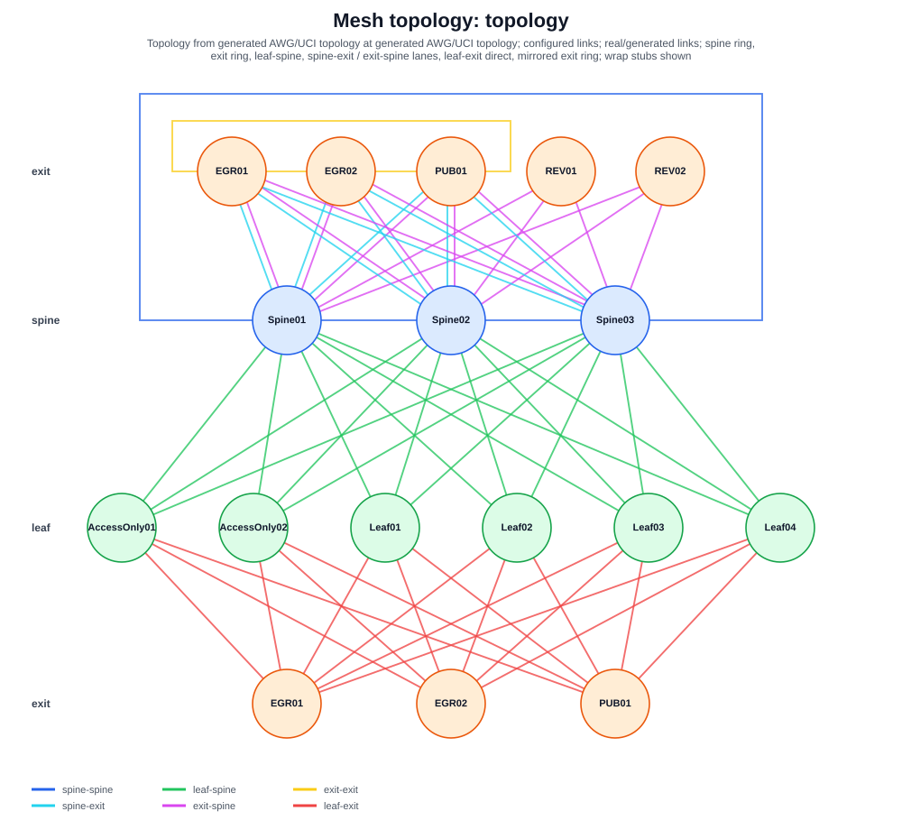

# OpenWrt Spine-Leaf Mesh Builder



OpenWrt Spine-Leaf Mesh Builder собирает из OpenWrt роутеров и Linux серверов небольшой routed fabric.

Spine здесь - это роутеры с публичным IP. Leaf - роутеры за NAT или с серым IP. Exit - управляемые точки выхода в интернет.

В результате получается не один VPN туннель до одного сервера, а routed mesh сеть:

- роутеры видят друг друга через overlay
- leaf без входящего public endpoint становится достижимым из других LAN и access сетей
- reverse exit без белого IP может участвовать в egress
- пользовательский трафик получает несколько отказоустойчивых путей к интернету

Топология описывается в `config.json`.

Из нее генерируются:

- OpenWrt overlay files
- server configs
- access клиенты
- SSH aliases
- firewall rules
- Babel routing
- IPIP exit data-plane

OpenWrt firmware образы собираются отдельной командой:

```sh
./build_router_images.py
```

Проект рассчитан на OpenWrt 25.12+ с `apk` based ImageBuilder и AmneziaWG 3.1 пакетами.

> Текущий `config.json` - демонстрационный пример. Адреса из `203.0.113.0/24` и `198.51.100.0/24` нужно заменить на реальные адреса своей сети перед деплоем.

## Содержание

- [Что это дает](#%D1%87%D1%82%D0%BE-%D1%8D%D1%82%D0%BE-%D0%B4%D0%B0%D0%B5%D1%82)
- [Идея сети](#%D0%B8%D0%B4%D0%B5%D1%8F-%D1%81%D0%B5%D1%82%D0%B8)
- [Отказоустойчивость](#%D0%BE%D1%82%D0%BA%D0%B0%D0%B7%D0%BE%D1%83%D1%81%D1%82%D0%BE%D0%B9%D1%87%D0%B8%D0%B2%D0%BE%D1%81%D1%82%D1%8C)
- [Spine-leaf на домашних и edge роутерах](#spine-leaf-%D0%BD%D0%B0-%D0%B4%D0%BE%D0%BC%D0%B0%D1%88%D0%BD%D0%B8%D1%85-%D0%B8-edge-%D1%80%D0%BE%D1%83%D1%82%D0%B5%D1%80%D0%B0%D1%85)
- [Сетевые слои](#%D1%81%D0%B5%D1%82%D0%B5%D0%B2%D1%8B%D0%B5-%D1%81%D0%BB%D0%BE%D0%B8)
- [Адресация без ручного IPAM](#%D0%B0%D0%B4%D1%80%D0%B5%D1%81%D0%B0%D1%86%D0%B8%D1%8F-%D0%B1%D0%B5%D0%B7-%D1%80%D1%83%D1%87%D0%BD%D0%BE%D0%B3%D0%BE-ipam)
- [Что проект делает](#%D1%87%D1%82%D0%BE-%D0%BF%D1%80%D0%BE%D0%B5%D0%BA%D1%82-%D0%B4%D0%B5%D0%BB%D0%B0%D0%B5%D1%82)
- [Структура проекта](#%D1%81%D1%82%D1%80%D1%83%D0%BA%D1%82%D1%83%D1%80%D0%B0-%D0%BF%D1%80%D0%BE%D0%B5%D0%BA%D1%82%D0%B0)
- [Модель сети](#%D0%BC%D0%BE%D0%B4%D0%B5%D0%BB%D1%8C-%D1%81%D0%B5%D1%82%D0%B8)
- [Быстрый старт](#%D0%B1%D1%8B%D1%81%D1%82%D1%80%D1%8B%D0%B9-%D1%81%D1%82%D0%B0%D1%80%D1%82)
- [Как строятся линки](#%D0%BA%D0%B0%D0%BA-%D1%81%D1%82%D1%80%D0%BE%D1%8F%D1%82%D1%81%D1%8F-%D0%BB%D0%B8%D0%BD%D0%BA%D0%B8)
- [Служебная адресация](#%D1%81%D0%BB%D1%83%D0%B6%D0%B5%D0%B1%D0%BD%D0%B0%D1%8F-%D0%B0%D0%B4%D1%80%D0%B5%D1%81%D0%B0%D1%86%D0%B8%D1%8F)
- [Выбор exit и IPIP data-plane](#%D0%B2%D1%8B%D0%B1%D0%BE%D1%80-exit-%D0%B8-ipip-data-plane)
- [Direct lists и server guard](#direct-lists-%D0%B8-server-guard)
- [Firewall model на OpenWrt](#firewall-model-%D0%BD%D0%B0-openwrt)
- [Что генерируется](#%D1%87%D1%82%D0%BE-%D0%B3%D0%B5%D0%BD%D0%B5%D1%80%D0%B8%D1%80%D1%83%D0%B5%D1%82%D1%81%D1%8F)
- [Шаблоны, managed секции и customization](#%D1%88%D0%B0%D0%B1%D0%BB%D0%BE%D0%BD%D1%8B-managed-%D1%81%D0%B5%D0%BA%D1%86%D0%B8%D0%B8-%D0%B8-customization)
- [Что делает 99-firstboot-custom](#%D1%87%D1%82%D0%BE-%D0%B4%D0%B5%D0%BB%D0%B0%D0%B5%D1%82-99-firstboot-custom)
- [DoH и DNS failover](#doh-%D0%B8-dns-failover)
- [Секреты и key material](#%D1%81%D0%B5%D0%BA%D1%80%D0%B5%D1%82%D1%8B-%D0%B8-key-material)
- [SSH keys и aliases](#ssh-keys-%D0%B8-aliases)
- [config.json](#configjson)
- [tools/default.py](#toolsdefaultpy)
- [Основные команды](#%D0%BE%D1%81%D0%BD%D0%BE%D0%B2%D0%BD%D1%8B%D0%B5-%D0%BA%D0%BE%D0%BC%D0%B0%D0%BD%D0%B4%D1%8B)
- [Проверка скорости линков](#%D0%BF%D1%80%D0%BE%D0%B2%D0%B5%D1%80%D0%BA%D0%B0-%D1%81%D0%BA%D0%BE%D1%80%D0%BE%D1%81%D1%82%D0%B8-%D0%BB%D0%B8%D0%BD%D0%BA%D0%BE%D0%B2)
- [Рендер topology](#%D1%80%D0%B5%D0%BD%D0%B4%D0%B5%D1%80-topology)
- [Предусловия](#%D0%BF%D1%80%D0%B5%D0%B4%D1%83%D1%81%D0%BB%D0%BE%D0%B2%D0%B8%D1%8F)
- [Типовой рабочий цикл](#%D1%82%D0%B8%D0%BF%D0%BE%D0%B2%D0%BE%D0%B9-%D1%80%D0%B0%D0%B1%D0%BE%D1%87%D0%B8%D0%B9-%D1%86%D0%B8%D0%BA%D0%BB)
- [Полезные проверки](#%D0%BF%D0%BE%D0%BB%D0%B5%D0%B7%D0%BD%D1%8B%D0%B5-%D0%BF%D1%80%D0%BE%D0%B2%D0%B5%D1%80%D0%BA%D0%B8)
- [Что важно помнить](#%D1%87%D1%82%D0%BE-%D0%B2%D0%B0%D0%B6%D0%BD%D0%BE-%D0%BF%D0%BE%D0%BC%D0%BD%D0%B8%D1%82%D1%8C)
- [Для чего этот проект](#%D0%B4%D0%BB%D1%8F-%D1%87%D0%B5%D0%B3%D0%BE-%D1%8D%D1%82%D0%BE%D1%82-%D0%BF%D1%80%D0%BE%D0%B5%D0%BA%D1%82)
- [Не цели проекта](#%D0%BD%D0%B5-%D1%86%D0%B5%D0%BB%D0%B8-%D0%BF%D1%80%D0%BE%D0%B5%D0%BA%D1%82%D0%B0)
- [Коротко](#%D0%BA%D0%BE%D1%80%D0%BE%D1%82%D0%BA%D0%BE)
- [Лицензия](#%D0%BB%D0%B8%D1%86%D0%B5%D0%BD%D0%B7%D0%B8%D1%8F)

## Что это дает

Главная идея - превратить набор роутеров, VPS и домашних сетей в управляемую routed mesh сеть.

Возможности:

- Multi-exit egress: у роутера может быть несколько exit серверов с приоритетом. Активный выход выбирается по Babel достижимости.
- Связность между роутерами: это не только путь до exit, но и путь до LAN другого роутера, даже если тот за NAT.
- Reverse узлы: leaf router или exit без белого IP сам подключается к spine и становится частью overlay после bootstrap.
- Dynamic routing: Babel перестраивает overlay path при падении линка, spine или exit достижимости.
- Детерминированная адресация: p2p `/31`, node IP, announce prefixes и порты генерируются стабильно из имен и link keys.
- Безопасность не превращается в flat network: firewall zones, `allow_to_router`, `allow_to_lan`, access policies, direct lists и server guard ограничивают, кто куда может ходить.

Итоговый пользовательский эффект простой: если один путь сломался, сеть часто может найти другой.

Если перестроился только внутренний путь до того же exit, внешний сайт продолжает видеть тот же egress NAT IP. Поэтому для пользователя это чаще выглядит как короткая потеря пакетов, а не как полная смена сети.

Если меняется сам selected exit и внешний NAT IP, старые TCP сессии могут оборваться, но новые соединения уйдут через доступный выход.

## Идея сети

Это не набор VPN пиров `каждый с каждым`, а routed fabric с разделением control-plane и data-plane.

Внизу находится обычный WAN/Internet underlay:

- провайдерские сети
- публичные IP
- серые IP
- NAT
- VPS
- домашние роутеры

Поверх него строится encrypted infra overlay из p2p AWG/WG линков.

На этих линках работает Babel, поэтому маршруты внутри сети не прописываются руками для каждой пары узлов, а появляются и исчезают динамически.

Поверх этого есть отдельный exit data-plane. Пользовательский трафик, который должен выйти через exit, не просто отправляется в один VPN интерфейс.

Роутер инкапсулирует его в IPIP до active exit, а маршрут до IPIP endpoint выбирается overlay routing.

Поэтому реальный путь пакета может быть достаточно хитрым:

- через spine
- через другой router
- через другой exit как transit overlay hop, если так сошлась маршрутизация

Благодаря этому multi-exit схема удобнее обычного варианта `один роутер -> один VPN сервер`.

Fabric дает не только egress в интернет, но и связность между площадками:

- можно разрешить LAN одного роутера ходить к LAN другого
- можно подключить access клиента к одному публичному endpoint и все равно попасть в нужный remote segment
- можно держать exit сервер без входящего public endpoint

При этом связность не означает открытый общий broadcast domain. Проект генерирует routed overlay, а не L2 мост.

Firewall model остается явной:

- LAN, Mesh, Exit, ExitIPIP, TrustedAccess и TransitAccess разделены зонами
- доступ к роутерам и LAN задается через `allow_to_router` и `allow_to_lan`
- direct destinations не отправляются через exit
- server guard на exit дополнительно дропает нежелательный direct выход, если такой пакет все же дошел до сервера

## Отказоустойчивость

За счет Babel сеть получает практическую отказоустойчивость на уровне маршрутизации.

Если leaf роутер теряет один spine, но видит другой, Babel перестраивает маршрут.

Если public exit недоступен напрямую, путь до его overlay endpoint может пройти через другой живой узел.

Если reverse exit не имеет белого IP, он все равно может подключиться наружу к spine и стать доступным внутри overlay после bootstrap.

За выбор активного egress отвечает `exit-route.sh`.

Он раз в 5 секунд проверяет, какой exit marker prefix виден через Babel, выбирает первый reachable exit из `exit_order` и синхронизирует с ним default route в table `10000`.

Если ни один exit не анонсируется через Babel, скрипт оставляет UCI секцию `network.exit10000`, но ставит:

```text
disabled=1
```

В этом состоянии policy route не применяется, и трафик возвращается на обычный main default path.

Это не заменяет физическую отказоустойчивость провайдера или питания. Если у узла не осталось ни одного живого пути в fabric, маршрутизировать его уже некуда. Но пока есть альтернативный tunnel path, сеть может переживать падение отдельных линков, spine узлов и exit.

## Spine-leaf на домашних и edge роутерах

В ЦОДовой spine-leaf схеме leaf подключает клиентов и серверы, а spine дает связность между leaf узлами.

Здесь та же идея применяется к домашним роутерам, VPS и NAT.

Роутеры с белым IP становятся spine/hub узлами. Они принимают входящие tunnel связи от:

- leaf роутеров
- других spine
- exit серверов

Роутеры с серым IP или за NAT становятся leaf узлами. Им не нужен входящий доступ из интернета: они сами поднимают outbound туннели ко всем публичным spine.

`access_only` узел похож на edge endpoint: он имеет публичный `listen_ip` и принимает пользовательские access группы, но не становится transit spine для infra mesh.

Exit серверы подключаются к fabric и дают управляемый egress в интернет.

Public exit принимает туннели напрямую. Reverse/internal exit сам подключается к spine и работает через overlay.

Так получается почти ЦОДовая модель, но адаптированная под реальность домашних роутеров, VPS и NAT: белые адреса становятся точками агрегации, серые адреса остаются leaf, а маршрутизация между ними остается динамической.

## Сетевые слои

Проект разделяет несколько слоев:

```text
WAN underlay         реальная сеть провайдера, NAT, public IP, VPS
encrypted overlay    p2p AWG/WG линки между router, spine и exit
routing plane        Babel поверх tunnel интерфейсов
exit data-plane      IPIP от роутеров до выбранного exit
policy plane         fwmark, uid rule и routing table 10000
```

AWG/WG линки дают защищенную связность и транспорт для Babel.

Babel отвечает за достижимость overlay узлов и service prefixes.

IPIP используется отдельно как data-plane до exit сервера. Пользовательский трафик, который должен выйти через exit, направляется в table `10000` и уходит через активный IPIP интерфейс.

## Адресация без ручного IPAM

Служебная адресация генерируется детерминированно из имен узлов и link keys.

Не нужно вручную вести таблицу p2p адресов и портов.

Основные идеи:

- infra p2p линки получают `/31` из `INFRA_LINK_POOL`
- exit announce prefixes получают `/31` из `EXIT_ANNOUNCE_SUPERNET4`
- exit node prefixes получают `/31` из `EXIT_NODE_SUPERNET4`
- IPv6 link-local адреса для infra линков строятся из IPv4 адресов
- AWG ports и часть служебных имен также выбираются стабильно
- генератор и validation hook `tools.validate` проверяют пересечения и ошибки

То есть `config.json` описывает намерение:

- какие есть узлы
- кто является spine
- какие есть exit
- какие есть access входы

Низкоуровневые адреса, p2p сети, интерфейсы, firewall zones, Babel config и SSH aliases выводятся из этой модели автоматически.

## Что проект делает

После запуска:

```sh
./generate_configs.py
```

появляются:

- конфиги для OpenWrt роутеров
- конфиги для exit серверов
- AmneziaWG, WireGuard и OpenVPN access группы
- Babel routing поверх tunnel линков
- IPIP data-plane до exit серверов
- firewall zones
- allow rules
- fwmark и policy routing
- direct ipsets для трафика, который не надо отправлять через exit
- server guard rules против нежелательного direct выхода
- per-router и per-server SSH keys
- SSH config

OpenWrt firmware образы появляются отдельно после:

```sh
./build_router_images.py
```

и складываются в:

```text
images/
```

Сами шаблоны лежат в:

```text
routers/example
servers/example
```

Конкретные узлы создаются рядом с ними после запуска:

```sh
./generate_configs.py
```

## Структура проекта

```text
.
|-- LICENSE
|-- README.md
|-- build_router_images.py
|-- collect_link_speeds.py
|-- config.json
|-- deploy_servers.py
|-- generate_configs.py
|-- render_topology_2d.py
|-- render_topology_3d.py
|-- run_routers.py
|-- run_servers.py
|-- upgrade_routers.py
|-- routers
|   `-- example
|-- servers
|   `-- example
|-- tools
`-- topology
    |-- topology-2d.html
    |-- topology-2d.svg
    `-- topology-3d.html
```

Основные файлы:

| Путь | Назначение |
| ------------------------ | ---------------------------------------------------------------- |
| `config.json` | Declarative topology model. |
| `generate_configs.py` | Генерация router/server configs, keys, access groups и проверок. |
| `build_router_images.py` | Сборка OpenWrt firmware через ImageBuilder. |
| `deploy_servers.py` | Деплой generated server tree на exit серверы. |
| `upgrade_routers.py` | Обновление роутеров через sysupgrade images. |
| `run_routers.py` | Запуск команд на роутерах. |
| `run_servers.py` | Запуск команд на exit серверах. |
| `collect_link_speeds.py` | Сбор iperf3 замеров между узлами. |
| `render_topology_2d.py` | Рендер 2D Canvas HTML и статического topology SVG. |
| `render_topology_3d.py` | Рендер интерактивной 3D HTML topology. |
| `routers/example` | Шаблон OpenWrt router tree. |
| `servers/example` | Шаблон Linux server tree. |
| `tools/` | Генераторы, defaults, secrets, validation и helper scripts. |
| `topology/` | Сгенерированные topology HTML и SVG файлы. |

## Модель сети

Основные сущности в `config.json`:

```text
openwrt_version    версия OpenWrt по умолчанию, минимум 25.12; поддерживается 25.12-SNAPSHOT
device_profiles    соответствие профиля OpenWrt target/subtarget и apk arch
packages           дополнительные глобальные пакеты для всех роутеров
routers            все OpenWrt роутеры проекта
mesh_hubs          публичные router узлы со spine ролью или access endpoint
exit_hubs          Linux серверы выхода в интернет
exit_order         глобальный приоритет exit серверов
access             пользовательские WG/AWG/OpenVPN входы на router узлах
```

### Router

`routers` описывает все OpenWrt устройства.

У router задаются:

- `name` - имя узла
- `openwrt_version` - необязательная версия OpenWrt только для этого роутера; перекрывает top-level `openwrt_version`
- `device_profile` - обязательная ссылка на профиль из `device_profiles`
- `subnet` - LAN сеть роутера, обычно canonical `/24`
- `packages` - per-router добавление или удаление дополнительных пакетов
- `wifi_2g`, `wifi_5g` - Wi-Fi параметры
- `pppoe` - необязательные WAN PPPoE credentials и MTU
- `allow_to_router` - к каким target роутерам разрешен INPUT на сам роутер
- `allow_to_lan` - к каким target роутерам разрешен FORWARD в их LAN
- `exit_order` - индивидуальный порядок выбора exit серверов
- `routing_rules` - выбор маршрутизации для отдельного IPv4-устройства

`allow_to_router` и `allow_to_lan` описывают исходящее разрешение от source сети текущего роутера или access группы к удаленным target роутерам.

Это не входящая ACL на source. Генератор добавляет firewall rules на target роутере. Поскольку Babel может выбрать путь к target как через `Mesh`, так и через `Exit`, разрешение принимается с обоих overlay ingress и не зависит от выбранного Babel next-hop. Явно указывать source router как target запрещено как для router-level, так и для access-group `allow_to_router`/`allow_to_lan`; значение `all` означает все остальные роутеры и также исключает source router. Локальный доступ определяется локальной firewall policy: для access группы - зоной `TrustedAccess`/`TransitAccess`.

Пример:

```json
{
  "name": "Leaf01",
  "openwrt_version": "25.12-SNAPSHOT",
  "device_profile": "asus_rt-ax53u",
  "subnet": "10.101.11.0/24",
  "allow_to_router": ["Spine01"]
}
```

Если `routers[].openwrt_version` не задан, используется top-level
`openwrt_version`. Поэтому в одном deployment можно одновременно держать,
например, большинство роутеров на `25.12.5`, а один роутер на
`25.12-SNAPSHOT`.

В этом фрагменте LAN `Leaf01` может обращаться к самому роутеру `Spine01`.

Пример доступа в LAN других роутеров:

```json
{
  "name": "Leaf04",
  "device_profile": "asus_rt-ax53u",
  "subnet": "10.101.21.0/24",
  "allow_to_lan": ["Spine01", "Leaf01"]
}
```

В этом фрагменте LAN `Leaf04` может форвардиться в LAN `Spine01` и `Leaf01`.

Директория роутера создается как lowercase slug:

```text
Spine01 -> routers/spine01/
Leaf03  -> routers/leaf03/
```

### Mesh hub / spine

`mesh_hubs` добавляет публичную endpoint роль поверх уже описанного router узла.

Пример:

```json
{
  "name": "Spine01",
  "listen_ip": "203.0.113.11"
}
```

Обычный `mesh_hub` становится spine узлом: на нем слушаются infra AmneziaWG линки от leaf роутеров, других spine и exit серверов.

Babel использует эти линки как routed overlay.

Если указать `access_only: true`, узел получает публичный endpoint только для пользовательских access групп, но не становится spine:

```json
{
  "name": "AccessOnly01",
  "listen_ip": "203.0.113.31",
  "access_only": true
}
```

`mesh_hubs[].name` всегда ссылается на существующий router.

`listen_ip` задается canonical IPv4 адресом без порта и hostname.

Один и тот же `listen_ip` нельзя использовать в нескольких `mesh_hubs`, включая `access_only` hubs.

### Exit hub

`exit_hubs` описывает Linux серверы, через которые пользовательский трафик выходит в интернет.

Пример:

```json
{
  "name": "EGR01",
  "listen_ip": "198.51.100.21",
  "exit_ip": "198.51.100.121"
}
```

Поддерживаются варианты:

| Config | Смысл |
| ---------------------------- | ---------------------------------------------- |
| `name` | Reverse/internal exit без публичного endpoint. |
| `name + listen_ip` | Public exit, принимающий AWG связи. |
| `name + listen_ip + exit_ip` | Public exit с отдельным SNAT адресом. |

`listen_ip` - адрес, куда подключаются tunnel peers.

`exit_ip` - публичный egress адрес для SNAT. Если `exit_ip` не задан, сервер использует MASQUERADE через default interface.

`listen_ip` и `exit_ip` задаются только как canonical usable unicast IPv4 адреса. Hostname и `ip:port` не используются в config модели.

Имя exit сервера ограничено сильнее обычных имен:

```text
A-Z, 0-9, _
первая буква: A-Z
максимум: 8 ASCII bytes
```

Это нужно, чтобы generated Linux IPIP device вида `ipip-ip` помещался в лимит 15 видимых байт.

Директория сервера создается как lowercase slug:

```text
EGR01 -> servers/egr01/
REV01 -> servers/rev01/
```

Reverse-only exit без `listen_ip` первично деплоится руками. После bootstrap он получает generated node IP из `EXIT_NODE_SUPERNET4`, и дальнейший SSH/deploy может идти через `server_<name>_node`.

### Access

`access` задает пользовательские входы в overlay.

Поддерживаемые протоколы:

- `wireguard`
- `amneziawg`
- `openvpn`

Пример:

```json
"access": {
  "Spine01": [
    {
      "name": "AdminWG",
      "protocol": "wireguard",
      "policy": "trusted",
      "port": 45110,
      "subnet": "10.201.1.0/24",
      "allow_to_router": ["all"],
      "allow_to_lan": ["all"],
      "users": ["AdminLaptop", "AdminPhone"]
    }
  ]
}
```

Access группа должна висеть на router узле с публичным endpoint:

- обычном `mesh_hub`
- `access_only` hub

Политики:

| Policy | Firewall zone | Поведение |
| --------- | --------------- | --------------------------------------------------------------------------- |
| `trusted` | `TrustedAccess` | Доступ к самому access роутеру, LAN, Mesh, Exit и WAN. |
| `transit` | `TransitAccess` | Нет доступа к самому роутеру и LAN; разрешен DNS и транзит в Mesh/Exit/WAN. |

`allow_to_router` и `allow_to_lan` у access группы работают так же, как у router.

Source сетью будет subnet access группы, а target роутеры берутся из соответствующего списка.

Access `port` не должен попадать в `INFRA_AWG_PORT_RANGE`, потому что этот диапазон принадлежит generated infra/exit tunnel ports.

Для `protocol: "amneziawg"` параметры AWG можно задать прямо в access группе. AWG 3.0/3.1 поля поддерживают диапазоны, поэтому полный пример выглядит так:

```json
"awg": {
  "jc": 4,
  "jmin": 64,
  "jmax": 205,
  "s1": 56,
  "s2": 48,
  "s3": 32,
  "s4": 16,
  "h1": "1517469637-1517625231",
  "h2": "1615261508-1615356639",
  "h3": "1930310431-1930508571",
  "h4": "2892801623-2893040131",
  "i1": "<r 128>",
  "i2": "",
  "i3": "",
  "i4": "",
  "i5": "",
  "rekey_after_time": "116-142",
  "rekey_timeout": "4-7",
  "reject_after_time": "190-217",
  "keepalive_timeout": "10-15",
  "max_handshake_attempts": "15-21",
  "random_trailers": true,
  "disable_cookies": false,
  "persistent_keepalive": "20-26"
}
```

Этот блок вставляется рядом с `name`, `protocol`, `port`, `subnet` и `users` соответствующей AmneziaWG access группы. Если новые AWG 3.x поля не указаны явно, builder детерминированно выводит их из access group key.

`HeaderProtectionKey` и `ContentPaddingAddition` также поддерживаются как `header_protection_key` и `content_padding_addition`. Если `header_protection_key` не задан явно, builder детерминированно выводит общий 32-byte Base64 key из access/infra link key. При включенном header protection все `S1-S4` должны быть не меньше `12`; generated infra `S1-S4` сразу детерминированно выбираются из диапазонов с нижней границей `12`. `ContentPaddingAddition` оставлен пустым, чтобы transport padding делал `RandomTrailers`.

## Быстрый старт

```sh
# 1. Описать сеть
vim config.json

# 2. Сгенерировать конфиги, ключи и проверки.
# Clean archive содержит только routers/example и servers/example.
# Целевые routers/* и servers/* создаются из config.json.
# OWMB master key files создаются автоматически по
# secrets_key_path/materials_key_path.
./generate_configs.py

# 3. Задеплоить exit серверы
./deploy_servers.py

# 4. Собрать OpenWrt firmware образы
./build_router_images.py

# 5. Обновить роутеры образами текущего git commit из images/
./upgrade_routers.py
```

Для локального просмотра структуры, без загрузки AWG/c-ares пакетов и без синхронизации `packages/`, можно запускать так:

```sh
./generate_configs.py --skip-awg-download --skip-cares-download --skip-package-sync
```

Такой режим удобен, если custom `.apk` и per-router package repos уже не нужны для текущей проверки.

Hooks при этом все равно запускаются, поэтому `tools/generate.py` все еще может требовать `wg` и `openssl`, если нужно создать недостающие WireGuard/OpenVPN secrets.

Для просмотра только синхронизированной template структуры без generator hooks добавляйте `--skip-hooks`:

```sh
./generate_configs.py --skip-awg-download --skip-cares-download --skip-package-sync --skip-hooks
```

Dynamic direct-list sources из `tools/default.py` должны быть доступны, если они включены.

Если нужен полностью локальный smoke run без загрузки country/ASN direct-list IP sets, добавьте `--skip-direct-downloads`:

```sh
./generate_configs.py --skip-awg-download --skip-cares-download --skip-package-sync --skip-direct-downloads
```

В этом режиме generated `direct.txt` будет содержать только static direct entries:

- `LOCAL_DIRECT_IPSETS`
- `EXIT_DIRECT_STATIC_IPSETS`
- listen IP mesh/exit hubs
- exit IP

## Как строятся линки

Infra связи строятся поверх AmneziaWG.

```text
spine-spine ring    между публичными spine
leaf -> spine       каждый leaf подключается ко всем spine
router -> exit      каждый router подключается ко всем public exit
exit -> spine       каждый exit подключается к публичным spine
exit-exit ring      между public exit серверами
```

Reverse exit без `listen_ip` не принимает входящие tunnel связи от роутеров. Он сам поднимает outbound туннели к публичным spine и становится доступен внутри overlay после bootstrap.

На infra линках не включается обычный default route. Они используются как транспорт для Babel и служебной маршрутизации.

### AWG 3.1 diversification

Infra AWG профиль генерируется детерминированно, но разделен на shared per-link и local per-direction параметры. Это дает воспроизводимые конфиги без одинакового fingerprint у всех направлений.

| Параметры | Модель |
| --- | --- |
| `S1-S4`, `H1-H4` | shared per-link: одинаковы на обоих концах одного линка |
| `Jc/Jmin/Jmax` | per-direction: `A -> B` и `B -> A` получают разные значения |
| `I1-I5` | per-direction; генерируется 1-2 signature packets размером 64-256 bytes |
| `RekeyAfterTime`, `RekeyTimeout`, `RejectAfterTime` | per-direction ranges |
| `KeepaliveTimeout`, `MaxHandshakeAttempts` | per-direction ranges |
| `PersistentKeepalive` | per-direction range внутри 20-30 seconds |
| `RandomTrailers` | включен |
| `DisableCookies` | выключен |
| `ContentPaddingAddition` | не задается |
| `HeaderProtectionKey` | shared per-link; детерминированный 32-byte key, auto-generation включен |

Babel timers также диверсифицированы per local tunnel direction: `hello_interval` выбирается в диапазоне 2-4 seconds, а `update_interval` - 8-14 seconds с привязкой к hello interval.

Для всех generated tunnel interfaces используется единый MTU profile: AWG/WG `1400`, IPIP `1380`. Физические Ethernet/PPPoE MTU builder этим не меняет.

## Служебная адресация

Основные пулы задаются в `tools/default.py`.

```python
INFRA_LINK_POOL = "10.255.0.0/16"
EXIT_ANNOUNCE_SUPERNET4 = "10.254.0.0/24"
EXIT_NODE_SUPERNET4 = "10.254.1.0/24"
```

### Infra p2p links

Для AWG p2p линков генератор детерминированно выделяет `/31` из `INFRA_LINK_POOL`.

```text
link key -> stable hash -> /31 из 10.255.0.0/16
```

Для каждого IPv4 адреса дополнительно строится IPv6 link-local:

```text
10.255.x.y -> fe80::10:255:x:y/64
```

### Exit announce prefix

Каждый exit получает служебный `/31` из `EXIT_ANNOUNCE_SUPERNET4`.

Этот prefix не является публичным `exit_ip`. Он нужен роутерам как marker достижимости exit.

Если Babel видит marker prefix, `exit-route.sh` считает соответствующий exit usable для IPIP data-plane.

### Exit node prefix

Каждый exit получает node/control prefix из `EXIT_NODE_SUPERNET4`.

Он нужен для:

- SSH к exit серверу после bootstrap
- healthcheck
- inventory
- доступа к reverse exit без белого IP
- доступа к public exit, если SSH по public IP закрыт

Node IP выбирается стабильно по имени exit, а не по позиции в `exit_order`.

## Выбор exit и IPIP data-plane

Пользовательский трафик до exit идет через IPIP.

На OpenWrt роутерах генерируются IPIP интерфейсы до exit серверов.

Их порядок определяется так:

1. `routers[].exit_order`, если задан.
1. Глобальный `exit_order` из `config.json`.

`exit_order` влияет на приоритет выбора выхода, но не меняет сгенерированные announce/node prefixes.

Глобальный `exit_order` должен содержать все exit серверы.

Per-router `exit_order` может содержать только часть exit серверов. В этом случае роутер выбирает только из этого списка и не дополняет его глобальным порядком.

Для отдельного устройства можно выбрать один из трех режимов маршрутизации:

```json
"routing_rules": [
  {
    "src_ip": "10.101.1.50/32",
    "mode": "wan"
  },
  {
    "src_ip": "10.101.1.51/32",
    "mode": "split",
    "exit": "EGR02"
  },
  {
    "src_ip": "10.101.1.52/32",
    "mode": "exit",
    "exit": "EGR02"
  }
]
```

Режимы:

- `wan` - ставится служебная ненулевая mark `9999`; отдельные policy rule и
  routing table для нее не создаются, поэтому стандартный RPDB доходит до
  таблицы `main`, которая выбирает WAN или внутренний маршрут
- `split` - для destination вне ipset `direct` ставится mark выбранного exit
- `exit` - mark выбранного exit ставится для всего маршрутизируемого трафика
  устройства

Для `split` и `exit` поле `exit` обязательно. Для `wan` поле `exit` запрещено.

`src_ip` должен указывать ровно одно устройство: принимается IPv4-адрес без
маски или строгий `/32`. Сети вроде `/24` для `routing_rules` запрещены. Один
адрес нельзя указать более одного раза на одном роутере.

Для общей exit-политики используется единый policy ID `10000`: он одновременно
является firewall mark и номером routing table. Для каждого exit, реально
используемого режимом `split` или `exit`, назначается следующий policy ID:
`10001`, `10002` и далее. Порядок соответствует порядку exit в `exit_hubs`.

Индивидуальные правила `Routing-*` генерируются в managed-части до marker.
Общие `Exitlan`, `ExitTrustedAccess`, `ExitTransitAccess` остаются
после marker в `routers/example` и содержат условие `option mark '0'`. Поэтому
они ставят общую mark `10000` только пакету, который не был помечен ранее:
первая ненулевая mark сохраняется. `Routing-WAN-*` ставит `9999`,
`Routing-Split-*` ставит mark выбранного exit только для `!direct`, а
`Routing-Exit-*` ставит ее независимо от destination.
`ExitIPIPClearMark` использует `option set_mark '0'` и полностью очищает
служебную mark перед выходом в зону `ExitIPIP`.

Генератор изменяет только часть до marker. Строка marker и весь хвост после нее
дописываются побайтно без нормализации. Хвостом владеет только `tools/sync_rules.py`,
который берет его из `routers/example`. Валидация проверяет итоговый конфиг
каждого роутера и до, и после marker, но общий хвост не переписывает. Если
router-specific правило `Routing-*` обнаружено после marker, генератор
завершится с ошибкой, но не станет менять общий хвост.

На каждый выбранный exit, используемый роутером, генерируются один UCI
`config rule` (`mark -> lookup` той же таблицы) и один default `config route`
через соответствующий IPIP-интерфейс. Явного `blackhole` и fallback нет. Exit,
указанный только в `routing_rules`, все равно добавляется в IPIP-конфигурацию и
firewall-зону этого роутера. Для режима `wan` не создаются ни отдельная routing
table, ни policy rule: mark `9999` только защищает пакет от общих `Exit*`, а
затем стандартные правила RPDB приводят его к таблице `main`.

На роутере `exit-route.sh` периодически проверяет достижимость exit marker prefix через Babel и переключает активный выход.

Traffic steering делается через policy routing:

```text
fwmark 10000 -> table 10000
uid 4453    -> table 10000
```

Через table `10000` идут:

- помеченный пользовательский трафик
- DoH bootstrap трафик пользователя `https-dns-proxy`

Если ни один exit не достижим через Babel, `exit-route.sh` оставляет UCI секцию `network.exit10000`, но ставит:

```text
disabled=1
```

После этого помеченный трафик возвращается на обычный main default path.

## Direct lists и server guard

Проект различает трафик, который должен идти напрямую, и трафик, который должен идти через exit.

Direct lists собираются из нескольких источников.

Статическая часть генерируется в:

```text
/etc/ipsets/direct-static.txt
```

В нее попадают:

- локальные/private/special-use IPv4 сети из `LOCAL_DIRECT_IPSETS`
- публичные `listen_ip` и `exit_ip` из `config.json`
- дополнительные CIDR prefixes из `EXIT_DIRECT_STATIC_IPSETS`

Динамическая часть задается странами и ASN.

На роутерах и exit серверах эти настройки лежат в runtime env:

```sh
DIRECT_COUNTRIES='ru cn by'
DIRECT_ASNS='32590'
```

`update-ipsets.sh` читает `/etc/ipsets/direct-static.txt`, добавляет country/ASN lists, атомарно обновляет `/etc/ipsets/direct.txt` и перезагружает firewall только если итоговый список изменился.

Трафик к direct destination не получает mark `10000`, поэтому не уходит через exit table.

На exit серверах direct lists используются как обратная защита.

Нужные для guard настроек переменные лежат в:

```text
/etc/awg-server.env
```

Отдельный `/etc/router-autoinstall.env` на серверах не создается.

Нормальный direct трафик должен отсечься еще на роутере и не прийти на exit. Но если он все же пришел через managed exit subnet, `exit-direct-guard.service` держит FORWARD guard rule и дропает такой выход в WAN.

Иными словами:

```text
router direct rule  -> не отправлять direct destination на exit
server guard rule   -> если direct destination все же пришел на exit, drop
```

`exit-direct-guard.timer` обновляет guard ежедневно, а `awg-server-network.service` ставит guard из уже существующего списка при network-up.

## Firewall model на OpenWrt

Генератор создает managed zones:

- `Mesh` - infra overlay между роутерами
- `Exit` - AWG/WG линки к exit серверам
- `ExitIPIP` - IPIP data-plane до exit
- `TrustedAccess` - пользовательские trusted входы
- `TransitAccess` - пользовательские transit входы

Общая идея:

- LAN может идти в Mesh, Exit, ExitIPIP.
- TrustedAccess может идти в LAN, Mesh, Exit и WAN.
- TransitAccess не получает input к самому роутеру, но может транзитить.
- Точечный доступ к самим роутерам задается через `allow_to_router`.
- Direct destinations исключаются из exit marking через ipset.
- Точечный доступ к LAN других роутеров задается через `allow_to_lan`.
- IPIP destination clear mark rule снимает mark при уходе в `ExitIPIP`.

Файл:

```text
routers/example/files/etc/config/firewall_part
```

задает общую tail-часть после marker. В router-specific `firewall_part` часть
до marker генерируется отдельно, а часть начиная с marker целиком копируется
из `example` через `tools/sync_rules.py`:

```text
# Unique part up to this line
```

## Что генерируется

### Для роутеров

После `./generate_configs.py` для каждого router создается дерево managed/template файлов:

```text
routers/<router>/
  files/etc/config/network_part
  files/etc/config/firewall_part
  files/etc/config/babeld
  files/etc/dropbear/authorized_keys
  files/etc/router-autoinstall.env
  files/etc/ipsets/direct-static.txt
  files/etc/ipsets/direct.txt
  files/etc/scripts/*.sh
  files/etc/init.d/*
  files/etc/crontabs/root
  packages/*.apk
```

Access specific файлы появляются только на роутерах с соответствующими access группами:

```text
files/etc/config/openvpn                         # только при OpenVPN access
files/etc/openvpn/<access>/server.ovpn           # только при OpenVPN access
files/etc/openvpn/<access>/clients/*.ovpn        # только при OpenVPN access
files/etc/wireguard/<access>/clients/*.conf      # при WireGuard или AmneziaWG access
```

`routers/example` остается шаблоном.

Конкретные роутеры создаются рядом с ним в lowercase директориях.

### Для exit серверов

Для каждого exit создается:

```text
servers/<exit>/
  etc/awg-server.env
  etc/amnezia/amneziawg/*.conf
  etc/babel.conf
  etc/ipsets/direct-static.txt
  etc/ipsets/direct.txt
  etc/systemd/system/*.service
  etc/systemd/system/*.timer
  root/deploy.sh
  root/.ssh/authorized_keys
```

`servers/example` остается шаблоном.

Конкретные exit директории создаются в lowercase виде:

```text
EGR01 -> servers/egr01/
```

На exit серверах весь runtime env для `awg-server.sh`, включая direct-list refresh settings и `BABELD_CONF`, находится в:

```text
etc/awg-server.env
```

## Шаблоны, managed секции и customization

`routers/example` содержит базовый OpenWrt overlay:

- init scripts
- cron
- DoH
- watchcat
- network/firewall tails
- bootstrap

Некоторые файлы сшиваются по marker строке:

```text
# Unique part up to this line
```

Для merge файлов `tools/sync_rules.py` синхронизирует общую tail часть из `routers/example`, то есть все после marker.

Часть до marker остается узловой частью конкретного роутера, но `tools/generate.py` владеет своими managed UCI/bootstrap блоками внутри этой части и переписывает их из `config.json`.

Это касается прежде всего:

- `files/etc/config/network_part`
- `files/etc/config/firewall_part`
- `files/etc/uci-defaults/99-firstboot-custom`

`99-firstboot-custom` содержит функцию:

```sh
customization() {
    # Set subnet and name
    true
}
```

Генератор обновляет внутри нее managed блоки для:

- LAN IP
- hostname
- DoH source address
- Wi-Fi
- OpenVPN/Babel hotplug

Свою router-specific логику можно добавлять туда же:

- UCI настройки
- sysctl
- дополнительные firewall tweaks
- init enable
- локальные хаки под конкретное железо

Она выполнится на роутере при первом запуске образа, после общей подготовки и перед `uci commit`.

Практическое правило:

- generated managed блоки редактируются через `config.json` и генератор
- ручная логика живет рядом в `customization()` или в неменеджеренных UCI блоках до marker
- старые UCI-блоки с другой идентичностью автоматически не удаляются и остаются видимыми как unmanaged

`tools/show_unmanaged.py` скрывает generated блоки только при byte-exact совпадении с тем, что выводит генератор.

Для генерации конфигов и одновременного просмотра полного отчета по unmanaged частям используйте:

```sh
./generate_configs.py --details
```

Без `--details` после генерации выводится только общий SHA-256 отчета. Если конфиги уже сгенерированы и нужно повторно посмотреть отчет без запуска генератора, можно вызвать диагностический инструмент напрямую:

```sh
./tools/show_unmanaged.py --details
```

## Что делает 99-firstboot-custom

Bootstrap скрипт на OpenWrt при первом запуске образа:

- сшивает `network_part`, опциональный `dhcp_part` и `firewall_part` с реальными UCI файлами
- настраивает `https-dns-proxy` и dnsmasq
- создает пользователя и группу `doh` с uid/gid `4453`
- увеличивает log buffer
- ставит timezone
- отключает HTTPS listener LuCI на `443`
- отключает autostart `wan6`
- применяет DHCP client-id workaround для OpenWrt 25.12
- переносит deploy/build version в OpenWrt release files
- выполняет `customization()`
- делает `uci commit`

## DoH и DNS failover

Для каждого роутера генератор ведет managed DNS-записи в начале
`files/etc/config/dhcp_part` по объединению всех его `allow_to_router`: как
router-level правила, так и `allow_to_router` внутри access-групп этого роутера.
Если хотя бы одно правило содержит `allow_to_router: ["all"]`, создаются записи
для всех остальных роутеров; иначе создается union всех явно указанных target
routers. Например:

```text
router-spine01.mesh -> 10.101.1.1
router-leaf01.mesh  -> 10.101.11.1
```

Каждая запись указывает на LAN-адрес target роутера (`.1` его `/24`). Имя
приводится к lowercase, а `_` заменяется на `-`. Generated `hostrecord` секции
анонимные; записи пространства `router-*.mesh` в начале `dhcp_part`
пересобираются целиком, а все остальные существующие записи `dhcp_part`
сохраняются без удаления. Если `allow_to_router` изменится или будет удален,
устаревшие generated DNS-записи также удалятся.

В шаблоне `https-dns-proxy` настроены несколько DoH endpoints.

Dnsmasq по умолчанию смотрит на:

```text
127.0.0.1#5060
```

`check-doh.sh` раз в несколько секунд строит приоритетный список DNS endpoints:

1. DoH endpoints из `https-dns-proxy`.
1. DNS servers из `/tmp/resolv.conf.d/resolv.conf.auto`.

Выбор устроен так же, как в `exit-route.sh`: скрипт идет по приоритетному списку сверху вниз и останавливается на первом работающем endpoint. Поэтому в steady state автоматически проверяются только endpoints выше текущего и сам текущий:

- если более приоритетный endpoint снова заработал, dnsmasq переключается на него;
- если текущий endpoint жив, менее приоритетные endpoints не проверяются;
- если текущий endpoint перестал отвечать, сразу выбирается следующий работающий endpoint по приоритету;
- каждый новый цикл снова начинается с самого приоритетного endpoint, поэтому failback происходит автоматически.

`check-doh.sh` занимается только проверкой DNS и выбором endpoint. Жизненным циклом `https-dns-proxy` занимается procd; отдельный recovery `stop`/`start` перед DNS downgrade больше не нужен.

Выбранный endpoint синхронизируется с:

```text
dhcp.@dnsmasq[0].server
```

Если ни один endpoint не отвечает, скрипт ставит последний endpoint из списка как fail-open резерв. Обычно это DNS провайдера.

Дополнительно поддерживается split DNS по доменным зонам.

При каждом применении нового endpoint скрипт заново собирает `dhcp.@dnsmasq[0].server`:

1. добавляет доменные форварды для зон из `CHECK_DOH_PROVIDER_DOMAINS`;
1. добавляет общий DNS endpoint для остального трафика.

По умолчанию в `tools/default.py` задано:

```python
CHECK_DOH_DOMAIN = "google.com"
CHECK_DOH_PROVIDER_DOMAINS = ["ru", "xn--p1ai"]
```

В router runtime env это попадает так:

```sh
CHECK_DOH_DOMAIN='google.com'
CHECK_DOH_INTERVAL='5'
CHECK_DOH_RESOLV='/tmp/resolv.conf.d/resolv.conf.auto'
CHECK_DOH_RESOLV_WAIT_MAX='300'
CHECK_DOH_PROVIDER_DOMAINS='ru xn--p1ai'
```

`CHECK_DOH_RESOLV_WAIT_MAX` задает, сколько секунд `check-doh.sh` ждет появления `nameserver` в `CHECK_DOH_RESOLV` при старте службы.

`CHECK_DOH_PROVIDER_DOMAINS` задает доменные зоны, которые dnsmasq резолвит через провайдерские DNS из `CHECK_DOH_RESOLV`.

Значения пишутся без начальной точки.

Для IDN зон нужно указывать punycode. Для `.рф` используется:

```text
xn--p1ai
```

Если провайдер выдал DNS `192.168.8.1` и `192.168.8.2`, а активный DoH endpoint слушает `127.0.0.1#5060`, то dnsmasq получит примерно такой порядок серверов:

```text
/ru/192.168.8.1#53
/ru/192.168.8.2#53
/xn--p1ai/192.168.8.1#53
/xn--p1ai/192.168.8.2#53
127.0.0.1#5060
```

Итоговая логика:

```text
*.ru, *.рф        -> DNS провайдера из resolv.conf.auto
остальное         -> первый отвечающий endpoint из приоритетного списка
полный DNS outage -> последний endpoint из списка, обычно DNS провайдера
```

`CHECK_DOH_DOMAIN` - это домен для health check через `nslookup`.

Он не задает маршрут для `google.com`, а только определяет, какой домен проверяется на каждом DNS endpoint.

DoH процесс работает под uid `4453`, а network rule отправляет uidrange `4453-4453` в table `10000`.

Это позволяет DoH bootstrap трафику идти через выбранный exit так же, как помеченному пользовательскому трафику.

## Секреты и key material

Проект хранит чувствительные значения в исходном дереве как OWMB markers.

Обычные секреты и криптографический key material шифруются разными master key files.

В `config.json` задаются пути до master key files:

```json
{
  "secrets_key_path": "~/.ssh/router-autoinstall-demo/secrets.key",
  "materials_key_path": "~/.ssh/router-autoinstall-demo/materials.key"
}
```

`secrets_key_path` используется для обычных секретов:

- паролей
- токенов
- приватных значений в `config.json` и templates

`materials_key_path` используется для key material:

- WG/AWG private keys
- OpenVPN private keys
- OpenVPN CA private key
- access private keys

Markers:

```text
OWMB_PLAIN_SECRET_V1{...}
OWMB_ENC_SECRET_V1{...}
OWMB_PLAIN_MATERIAL_V1{...}
OWMB_ENC_MATERIAL_V1{...}
```

Шифрование выполняется Python кодом через `cryptography`:

```text
ChaCha20-Poly1305
32-byte master keys
12-byte nonce
AAD = marker name
```

Зашифровать обычный secret из stdin/TTY:

```sh
./tools/secrets.py encrypt --wrap 60
```

Зашифровать key material из stdin/TTY:

```sh
./tools/secrets.py encrypt-material --wrap 60
```

Зашифровать plaintext secret markers в файлах:

```sh
./tools/secrets.py encrypt-secrets config.json routers servers
```

Зашифровать plaintext key material markers в файлах:

```sh
./tools/secrets.py encrypt-materials routers servers
```

Расшифровать marker для проверки:

```sh
./tools/secrets.py decrypt 'OWMB_ENC_SECRET_V1{...}'
```

Расшифровать все markers в дереве и убрать OWMB обертки:

```sh
./tools/secrets.py decrypt-all .
```

Это оставляет реальные plaintext secrets и private keys без markers. Такой режим удобен только для staging/debug и не должен попадать в git.

Для обратного автоматического шифрования нужны `OWMB_PLAIN_*` markers, поэтому для редактирования удобнее использовать marker-preserving режим:

```sh
./tools/secrets.py decrypt-marked-all .
./tools/secrets.py encrypt-all .
```

Проверить, что markers не осталось в staging tree:

```sh
./tools/secrets.py assert-no-markers routers/spine01/files
```

Когда расшифровывается:

- при сборке роутерного образа `build_router_images.py` копирует `routers/<router>/files` во временную ImageBuilder директорию, расшифровывает там и проверяет `assert-no-markers`
- при деплое серверов `deploy_servers.py` копирует `servers/` во временный staging каталог, расшифровывает там и проверяет `assert-no-markers`

В исходном дереве private keys и секреты остаются зашифрованными. Если украден только репозиторий без master key files, из него нельзя получить приватные ключи, пароли и токены.

## SSH keys и aliases

`tools/ensure_ssh_keys.py` создает per-router и per-server ed25519 ключи, пишет public keys в generated trees и собирает локальный SSH config.

Путь задается в `config.json`:

```json
{
  "ssh_key_dir": "~/.ssh/router-autoinstall-demo"
}
```

Генерируются, например:

```text
router_spine01
router_leaf01
server_egr01
server_egr01_node
```

Router aliases имеют вид:

```text
router_<name>
```

Они указывают на LAN IP роутера, например:

```text
10.101.1.1
```

Server aliases бывают двух типов:

```text
server_<name>       public/bootstrap alias
server_<name>_node  overlay node alias
```

`server_<name>` нужен для первичного деплоя и обычно указывает на:

1. `listen_ip`
1. затем `exit_ip`
1. затем node IP, если публичного адреса нет

`server_<name>_node` указывает на generated node IP из `EXIT_NODE_SUPERNET4`.

Он полезен после bootstrap, особенно для reverse exit без public endpoint или когда SSH по public IP закрыт.

Примеры:

```sh
ssh -F ~/.ssh/router-autoinstall-demo/config router_spine01
ssh -F ~/.ssh/router-autoinstall-demo/config server_egr01
ssh -F ~/.ssh/router-autoinstall-demo/config server_egr01_node
```

Server tools по умолчанию используют `auto`: сначала пробуют `server_<name>_node`, затем `server_<name>`.

Режим можно выбрать явно:

```sh
./deploy_servers.py --server-ssh-mode node
./deploy_servers.py --server-ssh-mode public
./run_servers.py --server-ssh-mode node uptime
```

## config.json

Текущий `config.json` содержит такую topology модель:

```text
main_router: Spine01
routers: Spine01, Spine02, Spine03, AccessOnly01, AccessOnly02, Leaf01, Leaf02, Leaf03, Leaf04
mesh_hubs: Spine01, Spine02, Spine03
access_only mesh_hubs: AccessOnly01, AccessOnly02
exit_hubs: EGR01, EGR02, PUB01, REV01, REV02
exit_order: EGR01, EGR02, PUB01, REV01, REV02
access endpoints: Spine01, Spine02, AccessOnly01, AccessOnly02
```

Ключевые фрагменты текущего `config.json`:

```json
{
  "openwrt_version": "25.12.5",
  "ssh_key_dir": "~/.ssh/router-autoinstall-demo",
  "secrets_key_path": "~/.ssh/router-autoinstall-demo/secrets.key",
  "materials_key_path": "~/.ssh/router-autoinstall-demo/materials.key",
  "main_router": "Spine01",
  "exit_order": ["EGR01", "EGR02", "PUB01", "REV01", "REV02"],
  "packages": [
    "block-mount",
    "htop",
    "kmod-fs-vfat",
    "kmod-usb-storage",
    "luci-theme-material",
    "tcpdump"
  ],
  "device_profiles": {
    "asus_rt-ax53u": {
      "board": "ramips/mt7621",
      "arch": "mipsel_24kc"
    },
    "asus_rt-ax59u": {
      "board": "mediatek/filogic",
      "arch": "aarch64_cortex-a53"
    },
    "asus_tuf-ax4200": {
      "board": "mediatek/filogic",
      "arch": "aarch64_cortex-a53"
    },
    "netcraze_nc-1812": {
      "board": "mediatek/filogic",
      "arch": "aarch64_cortex-a53"
    },
    "xiaomi_mi-router-4a-gigabit-v2": {
      "board": "ramips/mt7621",
      "arch": "mipsel_24kc"
    },
    "xiaomi_mi-router-ax3000t": {
      "board": "mediatek/filogic",
      "arch": "aarch64_cortex-a53"
    }
  }
}
```

В демонстрационном `config.json` `Spine02` показывает per-router override:

```json
{
  "name": "Spine02",
  "openwrt_version": "25.12-SNAPSHOT",
  "device_profile": "asus_tuf-ax4200",
  "subnet": "10.101.2.0/24"
}
```

Остальные роутеры без `openwrt_version` используют top-level `25.12.5`.
Так в одном deployment одновременно используются release и snapshot.

Полный список роутеров, exit, access групп и Wi-Fi секретов лежит в самом `config.json`.

`packages` в `config.json` - это дополнительные user-facing пакеты.

Managed runtime packages проекта добавляются автоматически из `tools/default.py`:

```text
babeld
curl
iperf3
jq-full
libcares
luci
luci-app-https-dns-proxy
luci-app-watchcat
luci-proto-amneziawg
luci-proto-ipip
```

Access протоколы добавляют свои managed packages на тот роутер, где есть соответствующая access группа:

| Protocol | Auto package |
| ----------- | ----------------------------------------- |
| `wireguard` | `luci-proto-wireguard` |
| `openvpn` | `openvpn-openssl` |
| `amneziawg` | Использует already-required AWG packages. |

Если на одном роутере есть и WireGuard access, и OpenVPN access, в итоговый package set попадают оба пакета:

```text
luci-proto-wireguard
openvpn-openssl
```

Указывать их руками через `+` не требуется.

Глобальные `packages` пишутся без префиксов.

Per-router overrides используют `+` и `-`:

```json
{
  "name": "Leaf02",
  "device_profile": "xiaomi_mi-router-4a-gigabit-v2",
  "subnet": "10.101.12.0/24",
  "packages": [
    "-block-mount",
    "-kmod-fs-vfat",
    "-kmod-usb-storage",
    "-tcpdump",
    "+nano"
  ]
}
```

Удалять managed-required packages нельзя. Удаление пакета, которого нет в итоговом package set роутера, тоже считается ошибкой config.

### Top-level keys

Поддерживаемые top-level keys:

```text
ssh_key_dir
secrets_key_path
materials_key_path
openwrt_version
packages
device_profiles
main_router
routers
mesh_hubs
exit_hubs
exit_order
access
```

### Device profiles

`device_profiles` связывает короткое имя профиля с OpenWrt target/subtarget и apk arch:

```json
{
  "device_profiles": {
    "asus_rt-ax59u": {
      "board": "mediatek/filogic",
      "arch": "aarch64_cortex-a53"
    }
  }
}
```

`board` используется для выбора OpenWrt ImageBuilder и всегда имеет вид:

```text
target/subtarget
```

`arch` используется для AWG `.apk` packages.

Profile name является безопасным ASCII identifier.

`board` segments и `arch` являются безопасными ASCII path segments. `.` и `..` как path segment не принимаются.

### Правила валидации config

`build_config_data()` является общим fail-fast слоем для основных entrypoints.

Он проверяет, что:

- top-level `openwrt_version` задан и не ниже `25.12`; принимаются обычные release версии и `*-SNAPSHOT`, например `25.12-SNAPSHOT`
- `routers[].openwrt_version`, если задан, проходит ту же проверку и перекрывает top-level версию только для этого роутера
- `main_router` задан и ссылается на существующий router
- router/access имена состоят только из `A-Za-z0-9_` и проверяются через generated Linux interface names
- `router.name` используется как generated `In`, поэтому имя router эффективно ограничено 13 ASCII bytes
- обычный non-`access_only` `mesh_hubs[].name` также используется как `Out`, поэтому для spine/hub эффективный лимит имени - 12 ASCII bytes
- access group `name` используется как interface name напрямую и ограничен 15 ASCII bytes
- `exit_hubs.name` использует `A-Z`, `0-9`, `_`, начинается с буквы и имеет максимум 8 ASCII bytes
- router/server directory slugs не конфликтуют case-insensitive
- `mesh_hubs[].name` ссылается на существующий router
- `listen_ip` и `exit_ip` являются canonical usable unicast IPv4 адресами
- router/access subnets записаны canonical и не пересекаются между собой и служебными пулами
- global `exit_order` перечисляет все exit hubs ровно по одному разу
- per-router `exit_order`, если задан, перечисляет непустое подмножество exit hubs без дублей и неизвестных имен
- отсутствующие exit для этого router не используются
- access ports не попадают в generated infra AWG port range
- package names и router package overrides имеют безопасный формат

### Wi-Fi

Пример Wi-Fi блока:

```json
{
  "wifi_2g": {
    "ssid": "Example-2G",
    "key": "OWMB_ENC_SECRET_V1{...}",
    "blocked_macs": ["aa:bb:cc:dd:ee:ff"]
  }
}
```

Если Wi-Fi блок не задан, соответствующее radio/interface отключается в bootstrap customization.

### PPPoE

Для конкретного роутера WAN можно переключить с DHCP на PPPoE:

```json
{
  "pppoe": {
    "username": "OWMB_ENC_SECRET_V1{...}",
    "password": "OWMB_ENC_SECRET_V1{...}"
  }
}
```

`mtu` указывать необязательно. По умолчанию генератор использует `1480`:

```json
{
  "pppoe": {
    "username": "OWMB_ENC_SECRET_V1{...}",
    "password": "OWMB_ENC_SECRET_V1{...}",
    "mtu": 1492
  }
}
```

Допустимый диапазон `mtu` - `1280..1492`. Секция генерируется внутри
`customization()` файла `99-firstboot-custom`. OWMB secret markers переносятся
на несколько строк так же, как Wi-Fi keys.

## tools/default.py

`config.json` описывает конкретную сеть, а `tools/default.py` задает глобальную механику проекта:

- пулы служебной адресации
- диапазон infra AWG ports
- AWG runtime defaults
- Babel defaults
- firewall zone names
- OpenVPN defaults
- DoH/DNS failover defaults
- direct-list sources
- OpenWrt/AWG/c-ares package URLs
- имена managed файлов и директорий

Именно там меняются правила, которые должны быть одинаковыми для всех конфигов.

## Основные команды

### generate_configs.py

Главная команда генерации:

```sh
./generate_configs.py
./generate_configs.py --config prod.json
./generate_configs.py --skip-awg-download --skip-cares-download --skip-package-sync
./generate_configs.py --skip-hooks
./generate_configs.py --force
./generate_configs.py --details
```

Что делает:

1. читает и валидирует `config.json`
1. создает `routers/` из `routers/example`
1. скачивает AmneziaWG `.apk`, если не указан `--skip-awg-download`
1. скачивает `libcares` из `c-ares-openwrt-package`, если не указан `--skip-cares-download`
1. синхронизирует per-router `packages/`, если не указан `--skip-package-sync`
1. синхронизирует шаблонные файлы из `routers/example`
1. запускает `tools/generate.py`
1. запускает `tools/ensure_ssh_keys.py`
1. запускает validation hook из `tools.validate`
1. запускает `tools/show_unmanaged.py`

Для package download/sync используется эффективная версия каждого роутера:
`routers[].openwrt_version`, а при её отсутствии top-level `openwrt_version`.
Если в одном config смешаны release и snapshot, пакеты скачиваются и хранятся
раздельно по версиям.

`--force` передается в `tools/generate.py` и пересоздает mesh/exit WG/AWG keys. Access secrets сохраняются.

`--details` после генерации печатает не только SHA-256, но и полный отчет по unmanaged sections/files. Это основной удобный способ проверить результат генерации; отдельно запускать `tools/show_unmanaged.py` обычно не требуется.

`--skip-hooks` пропускает запуск:

- `tools.generate`
- `tools.ensure_ssh_keys`
- validation hook из `tools.validate`
- `tools/show_unmanaged.py`

### deploy_servers.py

Копирует generated server tree на exit серверы через `scp` и запускает `/root/deploy.sh`.

```sh
./deploy_servers.py
./deploy_servers.py EGR01 PUB01
./deploy_servers.py --server-ssh-mode node REV01
./deploy_servers.py --replace-authorized-keys
./deploy_servers.py --ssh-connect-timeout 10
```

Деплой каждого сервера выполняется независимо: ошибка одного сервера не
останавливает обработку остальных. В конце выводится сводка `deployed/failed`
и список серверов с ошибками; при наличии ошибок процесс завершается с кодом 1.

Перед копированием файлов `deploy_servers.py` достает staged `root/.ssh/authorized_keys` и устанавливает его на сервер отдельным `ssh` вызовом.

Поэтому на чистом сервере пароль может понадобиться только для первого шага. Следующие `scp` и `ssh /root/deploy.sh` уже используют сгенерированный ключ из `ssh_key_dir`.

По умолчанию staged `authorized_keys` сливается с удаленным `/root/.ssh/authorized_keys` без дублей.

С `--replace-authorized-keys` файл заменяется.

В обоих режимах ключ ставится до `scp`, чтобы актуальный ключ уже лежал на сервере перед следующими SSH вызовами.

`--server-ssh-mode auto` сначала пробует node alias, затем public/bootstrap alias. Это удобно после bootstrap.

Для самого первого деплоя public exit обычно требует:

```sh
./deploy_servers.py --server-ssh-mode public
```

### build_router_images.py

Собирает OpenWrt firmware через ImageBuilder.

```sh
./build_router_images.py
./build_router_images.py Spine01
./build_router_images.py Spine01,Leaf01 --version 25.12.5
./build_router_images.py Spine01 --version 25.12-SNAPSHOT
./build_router_images.py --jobs 4
./build_router_images.py --jobs 1  # последовательная сборка
```

Без `--version` каждый роутер использует свой `routers[].openwrt_version`, если он
задан, иначе top-level `openwrt_version`. `--version` является явным override для
всех выбранных роутеров.

Для обычного deployment с локальными `.apk` (особенно `kmod`) предпочтительно менять
версию в `config.json` и снова запускать `generate_configs.py`, а не использовать
`build_router_images.py --version`: per-router `packages/` синхронизируются именно по
эффективной версии из config. Build-only override не пересобирает и не перекачивает
эти package repositories.

Скрипт сначала скачивает все уникальные ImageBuilder для выбранных
`version + target/subtarget`,
а после завершения загрузок параллельно собирает образы роутеров. По умолчанию число
одновременных сборок ограничено числом CPU и количеством выбранных роутеров; параметр
`--jobs` задаёт лимит явно. Роутеры с одинаковыми версией и `target/subtarget`
используют один заранее скачанный архив ImageBuilder, но распаковывают его в
независимые каталоги. Одинаковый target на разных версиях использует разные
ImageBuilder.

Результат складывается в:

```text
images/
```

Набор install образов зависит от OpenWrt device profile. Обычно есть `sysupgrade`, а `factory` появляется только для профилей, где его генерирует ImageBuilder.

```text
images/<router>_<version>_<git>_<timestamp>_sysupgrade.bin
images/<router>_<version>_<git>_<timestamp>_factory.bin
```

Перед сборкой encrypted secrets и key material расшифровываются только во временной ImageBuilder директории.

### upgrade_routers.py

Копирует `sysupgrade` образы из `images/` на роутеры и после подтверждения запускает async `sysupgrade -n`.

```sh
./upgrade_routers.py
./upgrade_routers.py Spine01 Leaf01
./upgrade_routers.py e47e68e
./upgrade_routers.py e47e68e Spine01 Leaf01
./upgrade_routers.py e47e68e --result-dir images --remote-dir /tmp
./upgrade_routers.py Spine02 --version 25.12-SNAPSHOT
```

По умолчанию для каждого роутера выбирается образ именно его эффективной версии:
`routers[].openwrt_version`, а если override не задан - top-level `openwrt_version`.
Это не дает случайно выбрать release-образ вместо snapshot (или наоборот), если в
`images/` лежат артефакты нескольких версий с одним git hash. `--version` является
явным override для всех выбранных роутеров и должен совпадать с версией, с которой
они были собраны.

Без positional `git_version` команда использует текущий git hash:

```sh
git rev-parse --short HEAD
```

И ищет `sysupgrade` образы с этим git hash в `images/`.

Порядок обновления:

```text
leaf routers -> mesh hubs except main_router -> main_router
```

### run_routers.py

Запускает команду на роутерах в том же порядке, что и upgrade.

```sh
./run_routers.py
./run_routers.py uptime
./run_routers.py 'ubus call system board'
```

Если команда не указана, показывает OpenWrt version из `/etc/os-release`.

### run_servers.py

Запускает команду на exit серверах.

```sh
./run_servers.py
./run_servers.py --servers EGR01,REV01 uptime
./run_servers.py --server-ssh-mode node 'systemctl status awg-server-network'
```

Если команда не указана, читает:

```text
/etc/deploy_version
```

## Проверка скорости линков

`collect_link_speeds.py` собирает directed iperf3 замеры для router-router, router-exit и exit-exit links.

Замеры запускаются параллельно, но только для link-ов без общей вершины. Пока
идёт `A -> B`, scheduler не запустит одновременно ни `A -> X`, ни `X -> A`,
ни `B -> X`, ни `X -> B`. Как только замер заканчивается, обе его вершины
освобождаются и scheduler сразу ищет следующий совместимый link. Это не даёт
нескольким iperf3-тестам одновременно нагружать один router/server.

Посмотреть матрицу целей без запуска iperf3:

```sh
./collect_link_speeds.py --list-targets
```

Обычный запуск показывает progress и одновременно сохраняет оба результата:

```sh
./collect_link_speeds.py
```

Человекочитаемая таблица записывается в
`link-speeds/link-speeds.txt`, а структурированные данные - в
`link-speeds/link-speeds.json`. Папка `link-speeds/` создаётся автоматически.
Предупреждения и ошибки по-прежнему выводятся в stderr. Progress можно
отключить через `--no-progress`.

Полезные опции:

```text
--topology-source generated
--topology-source config
--iperf-time 3
--iperf-bitrate 50M
-j 4
--jobs 4
--format table|tsv|json
--server-ssh-mode auto|node|public
--no-progress
```

`generated` читает реальные generated AWG/UCI files.

`config` строит плановую topology из `config.json`.

`--jobs` ограничивает число одновременно запущенных замеров. Без этой опции
лимит равен половине числа узлов topology; фактический parallelism может быть
ниже из-за правила no-shared-node. `--jobs 1` полностью отключает parallelism.

Для замеров на узлах нужны:

```text
iperf3
jq
```

## Рендер topology

### 2D HTML and SVG

`render_topology_2d.py` строит интерактивную HTML карту на Canvas и
статический SVG с topology colors.

Раскладка повторяет прежнюю SVG-развертку:

- верхний ряд exit, включая public и reverse exit
- spine ring
- leaf -> spine links
- раздельные `spine -> exit` и `exit -> spine` lanes
- нижний direct-view ряд public exit для `leaf -> exit`
- public `exit <-> exit` ring

Без аргументов renderer читает `link-speeds/link-speeds.json`:

```sh
./collect_link_speeds.py
./render_topology_2d.py
```

Другой файл с замерами можно передать явно:

```sh
./render_topology_2d.py --speeds-json /path/to/link-speeds.json
```

По умолчанию один запуск пишет два файла:

```text
topology/topology-2d.html
topology/topology-2d.svg
```

SVG всегда содержит только topology view. Отдельные SVG для `from` и `to`
не генерируются. Путь SVG можно изменить через `--svg-out`. Если задан
`--out`, но не задан `--svg-out`, SVG получает тот же basename и
расширение `.svg`.

В одной странице доступны:

- режимы цветов `from`, `to` и `topology`
- включение и выключение групп `spine-spine`, `leaf-spine`,
  `exit-spine`, `spine-exit`, `exit-exit`, `leaf-exit`
- диапазон скоростей от 0 до 500 Mbit/s с двумя ползунками
- затемнение либо полное скрытие links вне выбранного диапазона
- одинаковая легенда и фильтры в 2D и 3D
- pan, zoom, fit и hover tooltip

В speed режимах янтарный цвет означает `down`. Cyan не входит в шкалу
скоростей и обозначает отсутствующий link либо отсутствие пригодного замера
для выбранного направления (`iperf-fail`, `ssh-fail`, `jq-missing` или
полностью отсутствующий результат).

Порядок узлов в кольцах одинаков для 2D и 3D. Public exit идут в порядке
`exit_order`, а spine - в порядке `mesh_hubs`, который после загрузки
конфигурации является стабильным. Направление замыкающего ребра сохраняет
тот же обход кольца.

Topology-only без замеров:

```sh
# По плановой topology из config.json
./render_topology_2d.py --topology-only --topology-source config

# По реально generated AWG/UCI файлам после ./generate_configs.py
./render_topology_2d.py --topology-only --topology-source generated
```

`--only topology`, `--only from` и `--only to` сохранены для совместимости и задают начальный режим страницы. Переключить режим после открытия всё равно можно в панели.

### 3D HTML

`render_topology_3d.py` строит интерактивную Three.js карту.

```sh
./render_topology_3d.py
./render_topology_3d.py --topology-only --topology-source generated
./render_topology_3d.py --topology-only --topology-source config
```

По умолчанию HTML пишется сюда:

```text
topology/topology-3d.html
```

В measured режиме 3D renderer использует такой же двойной логарифмический фильтр скоростей, как 2D renderer: links вне диапазона можно затемнять или полностью скрывать.

## Предусловия

На build/deploy машине обычно нужны:

```text
python3
Python module cryptography
git
ssh
scp
ssh-keygen
curl
wg
openssl
apk-tools 3.x
tar с поддержкой zst
make
```

Для `apk-tools 3.x` нужен `apk`. Также используется `apk adbdump` или `apk manifest`.

Python module `cryptography` нужен для OWMB secret/material markers.

В Debian/Ubuntu это обычно пакет:

```text
python3-cryptography
```

В Arch Linux:

```text
python-cryptography
```

Для замеров скорости дополнительно нужны:

```text
iperf3
jq
```

На exit серверах предполагается Ubuntu/Debian compatible Linux с systemd, root доступом и `apt-get`.

Шаблонный `servers/example/root/deploy.sh` ставит:

- Babel
- ipset/iptables tooling
- iperf3
- jq
- AmneziaWG из PPA Amnezia

Если используется другой дистрибутив, нужно адаптировать `servers/example/root/deploy.sh` под его package manager и имена сервисов.

## Типовой рабочий цикл

```sh
# 1. Правим declarative config
vim config.json

# 2. Генерируем configs, keys, SSH aliases и проверки
./generate_configs.py

# 3. Деплоим servers
./deploy_servers.py

# 4. Собираем OpenWrt images
./build_router_images.py

# 5. Смотрим, какие images появились
ls -lh images/

# 6. Обновляем routers образами текущего git commit из images/
./upgrade_routers.py

# 7. Проверяем versions
./run_routers.py --no-clear
./run_servers.py --no-clear

# 8. Собираем текущие скорости и рендерим measured topology
./collect_link_speeds.py
./render_topology_2d.py
./render_topology_3d.py

# 9. Проверяем links и рисуем карту из нестандартного JSON
./collect_link_speeds.py --progress --out /tmp/link-speeds.txt --json-out /tmp/link-speeds.json
./render_topology_2d.py --speeds-json /tmp/link-speeds.json
./render_topology_3d.py --speeds-json /tmp/link-speeds.json
```

## Полезные проверки

Python syntax:

```sh
python3 -m py_compile *.py tools/*.py
```

Быстрая проверка template/config flow без загрузки custom packages:

```sh
./generate_configs.py --skip-awg-download --skip-cares-download --skip-package-sync --skip-direct-downloads
```

Валидация generated config:

```sh
python3 -m tools.validate
```

Генерация с полным отчетом по unmanaged sections/files:

```sh
./generate_configs.py --details
```

Remote versions:

```sh
./run_routers.py
./run_servers.py
```

Failed systemd units на exit:

```sh
./run_servers.py 'systemctl --failed'
```

## Что важно помнить

- `routers/example` и `servers/example` - шаблоны, а не целевые узлы.
- Router directories всегда lowercase: `routers/spine01`, `routers/leaf01`.
- Server directories всегда lowercase: `servers/egr01`, `servers/rev01`.
- `allow_to_router` разрешает INPUT на target роутер.
- `allow_to_lan` разрешает FORWARD в LAN target роутера.
- `exit_order` задает приоритет выхода, но не адресацию.
- Если все exit недоступны, `exit-route.sh` ставит `network.exit10000.disabled=1`, и трафик возвращается на main default path.
- Reverse exit без `listen_ip` первично деплоится руками, а после bootstrap доступен через generated node IP.
- `server_<name>_node` - overlay alias.
- `server_<name>` - public/bootstrap alias.
- Exit alias пишется lowercase, например `server_egr01`.
- `packages` в `config.json` - дополнительные пакеты.
- Обязательные runtime packages и access packages добавляются автоматически.
- `wireguard` access добавляет `luci-proto-wireguard`.
- `openvpn` access добавляет `openvpn-openssl`.
- Если на роутере есть оба access типа, добавляются оба пакета.
- `--force` пересоздает mesh/exit tunnel keys.
- Access secrets сохраняются.
- Секреты и key material остаются в исходном дереве как `OWMB_ENC_SECRET_V1{...}` и `OWMB_ENC_MATERIAL_V1{...}`.
- Секреты расшифровываются только в staging/build/deploy.
- Master key files из `secrets_key_path` и `materials_key_path` не должны попадать в репозиторий.
- Любую router-specific логику можно добавлять в `customization()` внутри `99-firstboot-custom`.

## Для чего этот проект

Проект подходит, если нужно:

- собрать routed mesh fabric из OpenWrt роутеров и Linux exit серверов
- автоматически генерировать AWG/WG overlay
- использовать Babel для dynamic routing
- иметь несколько exit серверов
- поддерживать leaf роутеры за NAT
- поддерживать reverse exit без public endpoint
- генерировать OpenWrt firmware images через ImageBuilder
- управлять router/server SSH aliases
- шифровать secrets и key material в git дереве
- рендерить topology и measured link speeds

## Не цели проекта

Проект не пытается:

- быть универсальным OpenWrt installer
- автоматически подменять всю сетевую архитектуру без понимания config
- превращать mesh в flat L2 network
- скрывать весь сетевой трафик от анализа
- быть production ready решением без аудита и тестов на вашей инфраструктуре
- поддерживать старые OpenWrt версии с opkg/ipk

## Коротко

```sh
vim config.json
./generate_configs.py
./deploy_servers.py
./build_router_images.py
./upgrade_routers.py
```

После этого можно проверить узлы и собрать topology:

```sh
./run_routers.py
./run_servers.py
./collect_link_speeds.py
./render_topology_2d.py
./render_topology_3d.py
```

## Лицензия

Проект распространяется под лицензией GNU Affero General Public License v3.0. Подробности смотрите в файле LICENSE.
